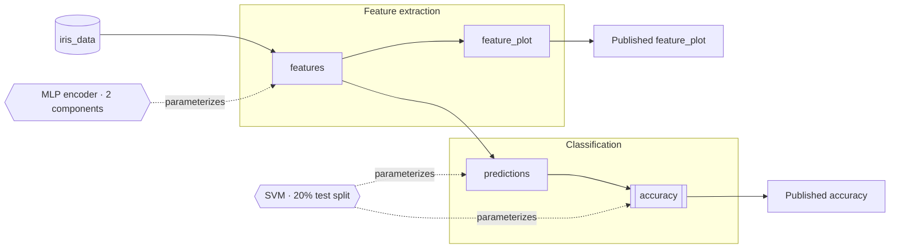

# ASTRA and Lightcone Integration

Status: assessment complete; viewer specified and ready to implement; no code
written yet
Snapshot date: 2026-07-27 (assessment), 2026-07-29 (viewer specification)

## Executive summary

ASTRA and Lightcone are a strong conceptual fit for Neurodesktop. The
integration has three layers, and they do **not** mature at the same rate:

1. **Specification** — `astra-spec` and `astra-tools` as a structured
   scientific analysis and validation layer. Low risk; adopt first.
2. **Visualization** — a JupyterLab widget that renders an ASTRA specification
   plus a selected universe as an interactive provenance graph, optionally
   overlaid with a real `lc` run. **This is the primary deliverable** and is
   specified in full below.
3. **Execution** — `lightcone-cli` (`lc`) as the production execution engine.
   Blocked on Apptainer support and generic Slurm submission; see
   [Blockers](#blockers-and-risks).

ASTRA is not another agent UI or an MCP protocol. It is a declarative YAML
format for recording an analysis's inputs, outputs, methodological decisions,
evidence, findings, and alternative decision universes. `astra-tools` validates
and inspects that record. `lightcone-cli` adds execution, output manifests,
integrity checking, HPC dispatch, and Workflow Run RO-Crate export.

The most useful near-term outcome is not another chat surface. It is an
agent-readable scientific contract that OpenCode, Claude, Codex, Notebook
Intelligence, notebooks, and humans can share — and a viewer that makes that
contract legible in Jupyter without overstating what it proves.

## Upstream components

| Component | Purpose | Maturity at this snapshot | Neurodesktop fit |
| --- | --- | --- | --- |
| [`astra-spec`](https://astra-spec.org/latest/) | LinkML-backed schema for `astra.yaml`, universe files, insights, and evidence | Early alpha; breaking changes are expected | Excellent as a scientific contract |
| [`astra-tools`](https://github.com/LightconeResearch/astra-tools) | `astra` CLI and Python SDK for scaffolding, validation, inspection, visualization, paper caching, and evidence verification | Alpha | Excellent; suitable for a pinned first integration |
| [`lightcone-cli`](https://github.com/LightconeResearch/lightcone-cli) | `lc` execution layer using Snakemake, Dask, containers, manifests, verification, and RO-Crate export | Beta | Promising, but its runtime assumptions need work |
| [Lightcone documentation](https://docs.lightconeresearch.org/) | User, CLI, HPC, architecture, and skill documentation | Moving quickly with the implementation | Useful, but versions must be pinned and rechecked |

Versions evaluated:

- `astra-spec==0.0.12`
- `astra-tools==0.2.11`
- `lightcone-cli==0.4.0`

The upstream code and schema are permissively licensed: the Python code uses
BSD-3-Clause, while schema reuse requires CC BY 4.0 attribution.

## Why ASTRA fits Neurodesktop

Neuroimaging results often depend on methodological choices that are scattered
across scripts, notebooks, command-line arguments, and researchers' memory.
ASTRA gives those choices explicit identities and connects them to affected
outputs.

Examples of suitable ASTRA decisions include:

- registration algorithm or reference space;
- smoothing kernel;
- censoring or motion threshold;
- mask construction and thresholding;
- preprocessing alternatives;
- statistical model, correction method, or prior;
- data inclusion and exclusion criteria.

Pure implementation choices that should not change the scientific result, such
as shell versus Python or equivalent file serialization, generally should not
be represented as methodological decisions.

This complements Neurodesktop's existing agent rules in
[`config/agents/AGENTS.md`](config/agents/AGENTS.md): discover available tools,
pin `module load` versions, submit substantial work through Slurm, retain the
scripts, and visually inspect outputs. ASTRA can describe why a pipeline exists
and which choices affect its outputs while those established mechanisms remain
responsible for execution.

Potential benefits include:

- machine-validated analysis specifications;
- explicit baseline and alternative analysis universes;
- traceable links from literature evidence to methodological choices;
- evidence-backed findings connected to produced artifacts;
- content-addressed output manifests and provenance-chain validation;
- structured handoff between agents and between interactive sessions;
- Workflow Run RO-Crate export for publication or archival;
- MyST reports that reference decisions and results instead of duplicating
  values in prose.

## Existing Neurodesktop integration points

| Neurodesktop capability | Potential ASTRA/Lightcone use |
| --- | --- |
| OpenCode, Claude, and Codex | Author or review `astra.yaml`, universes, recipes, and evidence using one shared contract |
| Notebook Intelligence | Explain or inspect the same project artifacts without introducing another model or credential path |
| `NEURODESK_API_KEY` and existing provider setup | Continue to provide model access; ASTRA and `lc` do not need a parallel LLM configuration |
| `ipywidgets==8.1.8` and `jupyterlab_widgets` ([`Dockerfile:576`](Dockerfile#L576)) | Already installed, so an `anywidget`-based viewer needs no JupyterLab frontend build |
| `extensions/neurodesk-launcher` ([`Dockerfile:591`](Dockerfile#L591)) | Established pattern for building and installing an in-repo JupyterLab extension |
| Neurocommand and Lmod | Supply explicitly versioned neuroimaging commands used by analysis scripts |
| Slurm | Run long analyses in batch allocations rather than in an agent's interactive shell |
| Apptainer and CVMFS | Provide reproducible neuroimaging software, once Lightcone can represent their use truthfully |
| Snakemake 9.6.2 | Satisfy a major existing `lightcone-cli` dependency |
| JupyterLab MyST extension | Edit and display MyST content; a separate MyST CLI is still needed for the generated Lightcone report workflow |
| NiiVue and desktop visualization tools | Support the visual QC required after outputs are materialized |

The current agent and OpenCode architecture is documented in
[`docs/architecture.md`](docs/architecture.md), with package installation in
the [`Dockerfile`](Dockerfile). This integration reuses those surfaces rather
than adding another chat UI or credential store.

## Compatibility evidence

A disposable validation was performed using the locally built
`neurodesktop:latest` image from this repository.

The image contained:

- Python 3.13.14;
- Snakemake 9.6.2;
- Apptainer and Singularity commands;
- OpenCode, Claude, and Codex;
- Slurm client commands;
- `tmux`;
- JupyterLab MyST 2.6.0.

It did not contain `astra`, `lc`, `uv`, `jq`, a Docker or Podman client, or the
`myst` CLI.

### Package-resolution check

Installing `lightcone-cli==0.4.0`, including `astra-tools`, into a disposable
copy of the current image completed successfully. `pip check` reported no
broken requirements. The resolution reused Neurodesktop's existing Snakemake
and RO-Crate dependencies and added the ASTRA, LinkML runtime, Dask,
`distributed`, and Dask Gateway packages without requiring a downgrade of the
existing Notebook Intelligence or LiteLLM stack.

This establishes Python-package feasibility, not complete image compatibility.
A real implementation still needs the normal build, startup, Jupyter, agent,
and full-image checks from [`docs/testing.md`](docs/testing.md).

### Execution smoke test

A minimal project with one decision and one output was run inside a disposable
Neurodesktop container:

1. `astra validate astra.yaml` passed schema and semantic validation.
2. `lc run --jobs 1` materialized the baseline-universe output.
3. `lc status --json` reported the output as `ok`.
4. `lc verify` reported that all outputs were verified.
5. `lc export wrroc` produced a Workflow Run RO-Crate directory containing
   the ASTRA spec, universe, result, manifest, and RO-Crate metadata.

The manifest recorded the decision selection, recipe, data hash, Lightcone
version, execution host, universe, and output identity. The smoke test omitted
a declared container, so it did not validate production container execution.

The documented example value `version: "1.0"` produced a warning when checked
against the released `astra-spec==0.0.12`. An implementation should use the
version generated by the pinned `astra` release and include a regression test
for the exact version contract rather than copying examples without checking
them.

---

## The Neurodesktop ASTRA viewer

This is the specification to implement. Everything above is background; this
section is the contract.

### Goal

Render an ASTRA specification plus one selected universe as an interactive,
universe-aware **provenance graph** in JupyterLab, optionally overlaid with a
real `lc` run, and make it honest about the difference between the two.

It is a provenance graph, not a timeline and not a tree of every possible
option. ASTRA describes the analysis *contract* and the methodological choices;
by itself it records no execution events (start time, duration, status, logs).
The existing `astra` CLI visualization displays only the decision space. This
viewer displays the decision space by default and layers real execution on top
**only** when a run manifest is supplied.

### Non-goals

- Editing `astra.yaml` from the widget. It is read-only in every milestone.
- Replacing or wrapping the `astra` or `lc` CLIs. The viewer reads files those
  tools produce; it never invokes them.
- Rendering large neuroimaging volumes. Volume QC stays with NiiVue and the
  desktop tools; the viewer links to artifacts rather than embedding them.
- A general-purpose workflow-graph viewer. The node and edge vocabulary is
  ASTRA's, not Snakemake's or Nextflow's.

### Decisions taken

| Question | Decision | Rationale |
| --- | --- | --- |
| Input contract | Spec + universe required; run manifest optional | Useful before `lc` execution is trustworthy; upgrades gracefully once it is |
| Home | In-repo `extensions/astra-viewer`, importable as `neurodesk_astra_view` | Matches `extensions/neurodesk-launcher`; no squatting on the upstream `astra.*` namespace; upstreamable later |
| Stack | `anywidget` + vendored Cytoscape.js | `ipywidgets` and `jupyterlab_widgets` are already installed, so this needs no `jupyter labextension build` and no federated-bundle rebuild |
| Execution posture | Example runs on the host with **no declared container**, and the widget states what the manifest does and does not prove | Avoids the `runtime: none` provenance mismatch entirely instead of papering over it |

`ipycytoscape` was considered and rejected: it ships its own JupyterLab
frontend bundle whose JupyterLab 4.6 compatibility is unverified, and this
image already carries two federated-bundle rebuild workarounds
([`Dockerfile:913`](Dockerfile#L913) for Notebook Intelligence,
[`Dockerfile:939`](Dockerfile#L939) for MyST/RISE). A third is not worth a
faster prototype. A full TypeScript labextension was rejected for M1–M4 but
remains the natural home for a double-click-to-open file handler later.

### Input contract

```python
AstraView(spec, universe=..., run=None, mode="flow")
```

| Input | Required | Format | Absent behavior |
| --- | --- | --- | --- |
| `spec` | Yes | Path to `astra.yaml` | Error |
| `universe` | No | Path to `universes/*.yaml` | Baseline universe is used; badge says "baseline" |
| `run` | No | Path to an `lc` run manifest, `lc status --json` output, or an RO-Crate directory | Graph is labelled **"Selected analysis"**; all status is `unknown` |

Note the asymmetry, because it is the most commonly misunderstood part: the
**YAML is the input** to Lightcone (`astra.yaml`, `universes/*.yaml`); what
`lc` emits is a **manifest** (JSON) plus materialized artifacts plus an
optional RO-Crate. The viewer reads both sides. "Visualize the YAML that comes
out of Lightcone" resolves to: visualize the spec and universe, and enrich the
same graph from the run manifest.

Every path is resolved relative to the notebook's working directory, and every
artifact preview is confined to the project root containing `astra.yaml`. No
path outside that root is read or served.

### Graph model

`build_graph()` is a pure function returning a JSON-serializable dict. It is
the entire testable core; the widget is a thin renderer over it.

```python
from neurodesk_astra_view.graph import build_graph

graph = build_graph(spec_path, universe_path=None, run_path=None)
# -> {"nodes": [...], "edges": [...], "gaps": [...], "trust": {...}, "meta": {...}}
```

#### Node kinds

| Kind | Meaning | Rendered as |
| --- | --- | --- |
| `input` | Declared external input or dataset | Cylinder |
| `output` | Declared output of a recipe | Rectangle; sub-kind `figure`, `metric`, `table`, `report`, `dataset` sets the icon |
| `analysis` | Sub-analysis grouping its children | Collapsible compound node |
| `decision` | Methodological decision | Hexagon; hidden in Flow mode, shown as an annotation in Decisions mode |
| `finding` | A claim made by the analysis | Note; Evidence mode only |
| `evidence` | Supporting paper or prior insight | Note; Evidence mode only |

Node fields: `id`, `kind`, `sub_kind`, `label`, `parent` (compound membership),
`description`, `recipe`, `when` (conditional expression, if any),
`when_satisfied` (bool or `null` when unevaluable), `resources`,
`selected_decisions` (list of `{decision_id, value}` for this universe),
`published` (bool), `status`, `artifact` (relative path + hash, run only),
`warnings`.

#### Edge kinds

| Kind | From → To | Rendered as |
| --- | --- | --- |
| `dataflow` | input/output → output | Solid arrow |
| `parameterizes` | decision → output | Dashed arrow, labelled with the selected value |
| `publishes` | output → published artifact | Solid arrow to a terminal node |
| `supports` | evidence → decision or finding | Dotted arrow; Evidence mode only |
| `claims` | output → finding | Dotted arrow; Evidence mode only |

#### Status enum

Only meaningful when `run` is supplied; otherwise every output is `unknown`.

`unknown` · `not_run` · `ok` · `stale` · `failed`

### The three modes

All three modes render **the same graph**, with the same layout and the same
node positions. Switching modes changes what is emphasized, never what exists.
This is what makes the views synchronized rather than three separate pictures.

- **Flow** — inputs → intermediate outputs → published outputs. Decision,
  finding, and evidence nodes are hidden. Sub-analyses are collapsible compound
  nodes, collapsed by default when a spec has more than one.
- **Decisions** — only the *selected* universe values, drawn as annotations on
  the outputs they parameterize. Unselected alternatives are never drawn on the
  canvas; they appear only in the inspector when a decision is clicked. This
  keeps the graph a picture of one universe rather than of the whole decision
  space.
- **Evidence** — findings, prior insights, and their supporting artifacts or
  papers overlaid on the same nodes.

### The inspector

Clicking any node opens one compact inspector panel. It never opens a second
panel and never navigates away from the graph.

Contents, in order, omitting empty sections:

1. Label, kind, and description.
2. Resolved recipe for this universe.
3. Selected decision values, each linking to the decision node; for a decision
   node, the full option set with the selected one marked.
4. Conditional `when` expression and whether it is satisfied in this universe.
5. Declared resources.
6. Run facts, only with a manifest: status, timestamps, resolved command,
   container digest, artifact path, hash, and a log excerpt.
7. Result preview, only with a manifest and a materialized artifact.

Preview rules by sub-kind: `figure` renders inline (PNG/SVG/JPEG only);
`metric` renders as a value with its units; `table` renders as a DataFrame
head via pandas; `report` renders as a link, plus an inline preview for
Markdown and MyST. Anything else renders as a link with size and hash. Preview
is capped (default 5 MB) and a file over the cap is always a link.

### Provenance trust

This is the most important behavior in the widget, and it exists because of
[Blocker 1](#1-apptainer-is-not-a-released-lightcone-runtime): `lc` will
happily record a declared container in a manifest while having executed the
recipe on the host. A viewer that renders that manifest without comment turns a
known provenance defect into a convincing picture. It must not.

The widget shows one persistent badge:

| Level | Condition | Badge |
| --- | --- | --- |
| `spec-only` | No run manifest | **Selected analysis** — grey. "Shows declared intent. Nothing here was executed." |
| `executed-unverified` | Manifest present, `lc verify` result absent or not passing | **Executed, unverified** — amber |
| `executed-verified` | Manifest present and `lc verify` passed | **Executed and verified** — green |
| `provenance-mismatch` | Manifest declares a container **and** the run resolved to `runtime: none` | **Provenance mismatch** — red, non-dismissible, names the declared image and states that it did not run |

`provenance-mismatch` outranks every other level. Detection of it is a required
unit test, and a fixture reproducing it ships with the viewer.

### Provenance-gap detection

Gaps are computed by `build_graph()` and surfaced as node badges plus a
collapsible list. Each has a stable id so tests can assert on it.

| Id | Rule | Severity |
| --- | --- | --- |
| `G1` | An output has no incoming `dataflow` edge and the spec declares no input for it | warning |
| `G2` | An analysis declares outputs but neither inputs nor decisions, so it is disconnected from the graph | warning |
| `G3` | A declared input has no outgoing edge | info |
| `G4` | A decision parameterizes nothing | warning |
| `G5` | A terminal output is not marked published | info |
| `G6` | A conditional output's `when` is unsatisfied in every declared universe | warning |
| `G7` | The manifest contains a node absent from the spec, or vice versa | error |

`G2` is the motivating case: an end-to-end comparison section that declares no
inputs and no decisions renders as an island, which is exactly the signal a
reviewer wants. The gap list is not a substitute for `astra validate` — if the
spec fails validation, the widget renders the validation errors instead of a
graph, with no partial picture.

### Public API

```python
from neurodesk_astra_view import AstraView

AstraView(
    "astra.yaml",
    universe="universes/mlp_svm.yaml",
    run="run-manifest.json",   # optional
    mode="flow",               # "flow" | "decisions" | "evidence"
)
```

Traitlets: `mode`, `selected_node`, `collapsed` (set of analysis ids). All are
readable and writable from Python, so a notebook can drive the widget and read
back what the user clicked.

Universe comparison is **not** in the MVP. When it lands, it is the same
constructor taking a list:
`AstraView("astra.yaml", universe=["a.yaml", "b.yaml"])`, rendering one graph
with per-node divergence marks. Deferred deliberately: a correct single-universe
graph is a prerequisite for a meaningful diff.

### File layout and packaging

```text
extensions/astra-viewer/
├── pyproject.toml                    # hatchling only — no npm, no hatch-jupyter-builder
├── README.md
├── neurodesk_astra_view/
│   ├── __init__.py                   # AstraView
│   ├── adapter.py                    # astra-spec -> internal model; the ONLY schema-aware module
│   ├── graph.py                      # build_graph(); pure, JSON-serialisable
│   ├── manifest.py                   # lc manifest / status / RO-Crate ingestion, trust level
│   ├── gaps.py                       # G1..G7
│   ├── preview.py                    # artifact previews, path confinement, size cap
│   ├── widget.py                     # anywidget subclass
│   └── static/
│       ├── index.js                  # widget ESM
│       ├── style.css
│       └── vendor/cytoscape.min.js   # vendored, checked in, license header retained
└── examples/
    └── iris_pipeline/                # or the neuroimaging pilot once it exists
```

Two constraints on this layout are load-bearing:

- **`adapter.py` is the only module that knows `astra-spec` field names.**
  `astra-spec` is early alpha and expects breaking changes; confining schema
  knowledge to one module means a schema bump touches one file and one set of
  fixtures. `graph.py`, `gaps.py`, and the widget speak only the internal model
  defined above. The adapter parses through the `astra-tools` SDK / LinkML
  classes rather than hand-rolling YAML.
- **Nothing is fetched at runtime.** Cytoscape.js is vendored into the wheel.
  Neurodesktop runs offline and on air-gapped HPC; a CDN reference is a build
  failure, and a unit test asserts there is no external URL in the shipped JS.

Dockerfile changes:

1. Add `astra-tools==<pin>` (and `lightcone-cli==<pin>` once the execution
   demo lands) to the pip block at [`Dockerfile:544`](Dockerfile#L544), plus
   `anywidget`.
2. Add a bind-mount install block for `extensions/astra-viewer` mirroring
   [`Dockerfile:591-600`](Dockerfile#L591-L600) — but simpler, because with
   anywidget there is no `jupyter labextension build` step and no npm cache to
   clean.
3. Add `jq` if the Lightcone hook scripts are ever adopted; not needed for the
   viewer.

### Tests

Per [`docs/testing.md`](docs/testing.md), default to the unit tier and use the
container tier only for what needs a running image. `build_graph()` being pure
is what makes almost all of this a unit test.

**`tests/unit/test_astra_view_graph.py`** — drives `build_graph()` over
checked-in fixtures:

- node and edge model for a two-analysis spec, including compound nesting;
- decision annotations reflect the *selected* universe and no other;
- a second universe produces different `parameterizes` labels from the same
  spec;
- conditional `when` sets `when_satisfied` correctly, including the unevaluable
  case;
- each gap rule `G1`–`G7` fires on a fixture built to trigger it, and does not
  fire on the clean fixture;
- trust level for each of the four cases, including a fixture where a manifest
  declares a container and the run resolved `runtime: none` → `provenance-mismatch`;
- an invalid spec yields validation errors and no graph.

**`tests/unit/test_astra_view_packaging.py`** — repository-source assertions:

- the shipped JS contains no `http://` or `https://` reference;
- `static/vendor/cytoscape.min.js` exists and retains its license header;
- `pyproject.toml` declares no npm build hook;
- the `Dockerfile` pins `astra-spec`/`astra-tools`/`anywidget` to exact
  versions;
- the preview module refuses a path outside the project root.

**`tests/container/test_astra_view_image.py`** — only what needs the image:

- `astra` and `lc` are on `PATH` at the pinned versions;
- `python -c "import neurodesk_astra_view"` succeeds;
- `anywidget` and `ipywidgets` import at the expected versions;
- `astra validate` passes on the shipped example with no version warning;
- importing the widget performs no network access.

### Milestones

| M | Scope | Done when |
| --- | --- | --- |
| **M1** | ASTRA + universe → interactive provenance graph. Flow and Decisions modes, inspector without previews, `spec-only` trust badge. | The iris example renders in JupyterLab; `tests/unit/test_astra_view_graph.py` and `test_astra_view_packaging.py` pass; `docs/` and `AGENTS.md` updated with the new test command |
| **M2** | Conditional-output evaluation, gap rules `G1`–`G6`, validation-error rendering, result previews. | Every gap rule has a passing fixture test; previews render figure/metric/table/report |
| **M3** | Findings and evidence overlay (Evidence mode). | Evidence mode renders `supports`/`claims` edges on the shipped example |
| **M4** | Runtime-manifest adapter: status, timing, artifact hashes, all four trust levels, `G7`. | `lc run` on the host-executed example produces a manifest the widget ingests; the `provenance-mismatch` fixture renders the red badge; `tests/container/test_astra_view_image.py` passes |

M1–M3 need no `lc` execution at all and are therefore not blocked by anything
in the next section. Only M4 touches Lightcone execution, and it is scoped to
the host-executed, no-declared-container example.

### Worked example

For a two-stage `mlp_svm` universe, the Flow and Decisions modes together
produce:



Mermaid is used here for documentation only. The widget renders with
Cytoscape.js, whose compound nodes give the collapsible `FE`/`CL` grouping.

### Viewer acceptance criteria

- The iris example renders in JupyterLab in the built image with no network
  access and no `jupyter labextension build` step.
- Switching modes preserves node positions and selection.
- Supplying a different universe changes the decision annotations and nothing
  else.
- Omitting `run` labels the graph "Selected analysis" and shows no status.
- A manifest declaring a container that did not run produces the red
  `provenance-mismatch` badge.
- A spec failing `astra validate` renders errors, not a partial graph.
- `pytest tests/unit/test_astra_view_graph.py tests/unit/test_astra_view_packaging.py`
  passes from a checkout; `pytest /opt/tests/test_astra_view_image.py` passes in
  the image.
- Existing JupyterLab, Notebook Intelligence, OpenCode Web, Claude, and Codex
  tests continue to pass.

### Open questions for implementation time

These do not block starting M1, but each needs an answer before the milestone
that depends on it:

1. **Exact `astra-spec` field names** for inputs, outputs, decisions, `when`,
   resources, findings, and evidence are not recorded in this document, because
   they must be read from the pinned release rather than from examples. First
   task of M1: pin the version, read the schema, and write `adapter.py` against
   it.
2. **`lc` manifest shape** — whether `lc status --json`, the on-disk manifest,
   and the RO-Crate expose the same fields, and which is canonical for the
   viewer. Answer before M4.
3. **How `runtime: none` is recorded** in the manifest, which determines how
   `provenance-mismatch` is detected. If it is not recorded at all, that is an
   upstream issue to file, and the viewer must degrade to
   `executed-unverified` rather than claim a container ran. Answer before M4.
4. **Which pilot example ships** — the iris pipeline is a good development
   fixture, but the shipped Neurodesktop example should be neuroimaging (see
   [Suggested first pilot](#suggested-first-pilot)). Decide before M1 is
   documented as complete.

---

## Blockers and risks

These gate **execution**, not the viewer. M1–M3 are unaffected.

### 1. Apptainer is not a released Lightcone runtime

Neurodesktop includes Apptainer, but `lightcone-cli==0.4.0` recognizes only:

- Docker;
- Podman;
- `podman-hpc`;
- Kubernetes via Dask Gateway;
- uncontained host execution.

The Lightcone
[`cluster guide`](https://docs.lightconeresearch.org/user/cluster/) explicitly
states that Apptainer and Singularity are not supported yet. In an ordinary
Neurodesktop container, automatic runtime selection therefore resolves to
`none`.

When an ASTRA analysis declares a container but `lc` runs with no supported
runtime, `lc` warns that the recipe will execute on the host while the manifest
continues to record the declared image. This is a provenance mismatch and must
not be accepted as a production configuration. The viewer's
`provenance-mismatch` badge exists specifically to make this visible rather
than plausible.

Upstream already has an
[`lc launch`/Apptainer design issue](https://github.com/LightconeResearch/lightcone-cli/issues/83).
Supporting Neurodesktop's existing Apptainer installation upstream is
preferable to maintaining a private execution path.

### 2. Released Slurm behavior does not match the default Neurodesktop policy

Released `lc run` expects to be launched inside an existing Slurm allocation.
It then creates a Dask scheduler and launches one worker per allocated node
with `srun`. It does not submit an ordinary asynchronous job from the login
session.

This can be used today by generating an `sbatch` script that activates the
environment and calls `lc run` inside the allocation. However, it is not yet
the native flow users would expect from the Neurodesktop agent guidance.

Upstream draft
[`lightcone-cli` PR #160](https://github.com/LightconeResearch/lightcone-cli/pull/160)
adds `lc run --async`, `sbatch` submission, job records, queue/status reporting,
and cancellation. It remains a draft and its checklist still includes real
Slurm validation. Neurodesktop should not depend on it until it is merged,
released, and tested on a representative cluster.

### 3. Script and environment identity need stronger provenance

Lightcone's current `code_version` hashes the recipe string, declared container
identity, and decision values. A recipe such as
`bash analysis_01_preprocess.sh` does not by itself ensure that changes inside
the script alter the manifest's code identity.

This matters for Neurodesktop because the preferred pattern is a retained Bash
script containing explicit `module load <tool>/<version>` commands. A robust
integration should capture at least:

- the content hash of every invoked analysis script;
- explicitly loaded module names and versions;
- the resolved CVMFS container or SIF identity where available;
- the Git commit and dirty-tree state;
- external input hashes or immutable dataset identifiers.

This should be solved upstream where possible, rather than encoded as a
Neurodesktop-only convention that other Lightcone tools cannot understand.

### 4. The released skill bundle is Claude-centric

The released `lc init` copies a `.claude/` plugin bundle and writes Claude Code
permission settings. Some reference skills are mostly portable Markdown, but
the larger workflows use Claude-specific tool names, hooks, subagents, and
`AskUserQuestion` behavior.

The paper-reproduction workflow also includes a detached "Ralph" loop that
starts Claude or Codex with approval and sandbox bypass flags. It should not be
enabled by default in a shared scientific environment.

Upstream
[`lightcone-cli` PR #161](https://github.com/LightconeResearch/lightcone-cli/pull/161)
is moving the skills into a marketplace, adding Codex registration, and
returning permission ownership to the agent harness. This is another reason
not to vendor the current `.claude/` tree into Neurodesktop. OpenCode support
would still require explicit adaptation and testing.

### 5. Supporting commands are missing

- The bundled Claude hooks call `jq`, which is not present in the current
  Neurodesktop image; those hooks would not provide their intended validation
  and status context.
- `lc init` prefers `uv` for project environments, although it can fall back to
  Python `venv` and `pip`.
- The generated MyST report instructions require the `myst` CLI. The existing
  `jupyterlab_myst` package does not provide that command.
- The generated MySTRA plugin URL follows `latest` by default. A reproducible
  Neurodesktop template should pin a tested MySTRA release.

### 6. Upstream is intentionally fast-moving

ASTRA identifies itself as early alpha and recommends pinning the schema
version. Lightcone has active work on asynchronous Slurm execution, skill
distribution, report templates, and container sandboxing. Exact versions and
contracts must be treated as part of the integration and exercised in tests.
This is the reason `adapter.py` is isolated.

## Adoption plan

### Phase 1: specification, validation, and the viewer

1. Pin compatible `astra-spec`, `astra-tools`, and `anywidget` versions in the
   image.
2. Add a harness-neutral ASTRA reference skill or agent guidance shared by
   OpenCode, Claude, and Codex.
3. Ship a small, realistic neuroimaging example containing:
   - BIDS-style input data;
   - one baseline universe;
   - one meaningful methodological alternative;
   - versioned Lmod analysis scripts;
   - metric, derivative, and visual-QC outputs;
   - **no declared container**, so no `runtime: none` mismatch can occur.
4. Build the viewer through M1–M3.
5. Add tests that verify the installed versions and validate all shipped ASTRA
   fixtures.
6. Continue to submit and monitor computation through the existing Slurm
   workflow.

This phase provides immediate value for planning, review, handoff, and evidence
without changing execution semantics.

### Phase 2: host-executed `lc` demo and the runtime adapter

1. Run the shipped example end to end with `lc run` on the host.
2. Implement M4 against the resulting manifest.
3. Verify all four trust levels, including the deliberately constructed
   `provenance-mismatch` fixture.

Nothing in this phase claims container-level reproducibility, and the widget
says so.

### Phase 3: controlled production `lightcone-cli` pilot

Pilot full execution after the following are true:

1. Apptainer is a first-class runtime, or another supported runtime is
   deliberately deployed.
2. The recorded container/environment identity matches what actually runs.
3. Script contents and versioned Neurodesk module identities participate in
   stale detection and provenance.
4. The Slurm path uses a tested batch workflow that follows Neurodesktop's
   no-heavy-work-in-the-interactive-shell policy.
5. `lc status`, `lc verify`, cancellation, failure handling, and RO-Crate export
   have been tested on a real representative workload.

A small existing BIDS/QC pipeline is a better first pilot than a full paper
reproduction. It exercises the important contracts while keeping scientific
and operational verification bounded.

### Phase 4: agent and deeper Jupyter integration

1. Adopt the upstream marketplace form of the reference skills when available.
2. Adapt and test the same workflows for OpenCode rather than offering a
   Claude-only experience.
3. Keep all model and API-key handling on Neurodesktop's existing provider
   path.
4. Add `jq` and any chosen project-environment tooling.
5. Add a pinned MyST CLI and MySTRA plugin if reproducible report preview is in
   scope.
6. Promote the viewer to a JupyterLab file-type handler so `astra.yaml` opens
   the graph on double-click, and add a launcher action such as "New
   reproducible ASTRA analysis".
7. Add universe comparison.

## Suggested first pilot

Use `/lc-from-code` conceptually, but not necessarily its current bundled
Claude implementation, to describe one small existing neuroimaging workflow.

The pilot should:

- start from retained, versioned analysis scripts;
- represent one scientifically meaningful decision with two defensible
  options;
- generate a metric, a derivative image, and an inspectable PNG QC artifact;
- execute in a Slurm batch allocation;
- record exact module/container and input identities;
- materialize both universes;
- pass `astra validate`, `lc status`, and `lc verify`;
- export a Workflow Run RO-Crate;
- render correctly in the viewer in all three modes;
- demonstrate that OpenCode, Claude, and Codex can all understand the same
  project without changing its model configuration.

## Production pilot acceptance criteria

The full Lightcone pilot (Phase 3) should not be considered successful until
all of the following are demonstrated from runtime evidence:

- the pinned packages install and `pip check` passes in the built image;
- the shipped ASTRA examples validate against the pinned schema without a
  version warning;
- no declared container runs through an implicit `runtime: none` fallback;
- a real Slurm job is submitted, monitored, and completed;
- the manifest identifies the actual executed environment;
- changing an analysis script or module version marks the affected output
  stale;
- changing an ASTRA decision produces a separate universe result;
- `lc verify` detects an intentionally modified result artifact;
- RO-Crate export contains the expected spec, universes, manifests, and
  results;
- the viewer shows `executed-verified` for that run and never
  `provenance-mismatch`;
- existing JupyterLab, Notebook Intelligence, OpenCode Web, Claude, and Codex
  tests continue to pass;
- user documentation explains what ASTRA records and what it does not prove.

## Recommendation

Build the viewer now. M1–M3 depend only on `astra-spec` and `astra-tools`,
which install cleanly and validate correctly today, and they deliver the main
scientific value — making methodological choices and their effects legible —
without depending on any of the open execution blockers.

Treat full `lightcone-cli` execution as a joint upstream integration project
centered on Apptainer, generic Slurm submission, and truthful Neurodesk
module/container provenance, and let the viewer's trust badge be the mechanism
that keeps the two honest about each other in the meantime.
