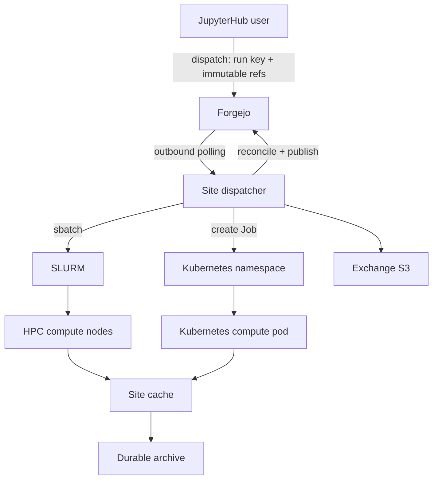
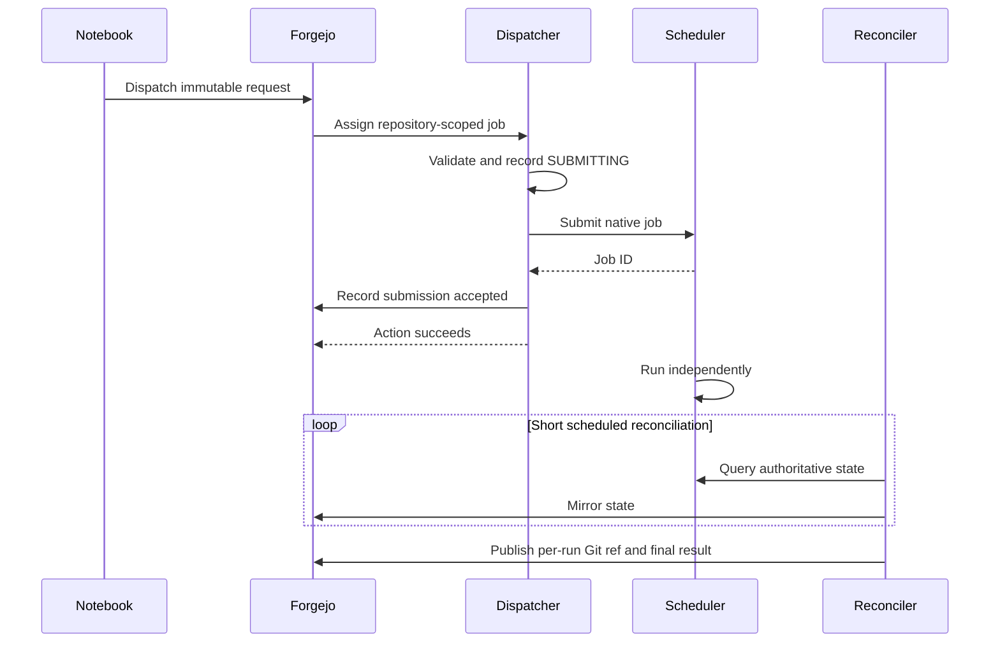
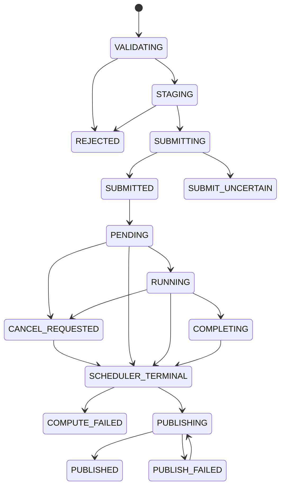

# Neurodesk Distributed Compute Broker

## Production design specification: JupyterHub → Forgejo Actions → site-local dispatchers → SLURM or Kubernetes, with DataLad-managed data and provenance

| Field | Value |
| --- | --- |
| Document status | Proposed implementation design |
| Version | 2.2 |
| Date | 30 July 2026 |
| Intended audience | Neurodesk platform engineers, HPC administrators, Kubernetes administrators, data stewards, security reviewers, and workflow authors |
| Initial pilot site | One arbitrary HPC system, called **Alpha** throughout; every Alpha-specific value is a placeholder for the real site |
| Recommended Forgejo line | Forgejo 15 LTS, with an explicitly pinned compatible Helm chart and current Forgejo Runner |
| Data classification | Designed for deidentified and approved human-subject research data; deployment still requires institutional review |

Document map: sections 1–3 define scope, invariants, and threat model;
4–7 architecture, identity/credentials, storage, and the data lifecycle;
8–10 the run state machine and the SLURM/Kubernetes implementations;
11–13 enrollment, runners, Forgejo/PostgreSQL deployment, and JupyterHub
integration; 14–18 operations, human-data controls, tests, rollout gates, and
remaining decisions.

---

## Executive summary

Users work in Neurodesk JupyterHub sessions on Kubernetes and submit analyses
to a site where the required data are already present. A submission is
represented in Forgejo, but bulk data never flow through Forgejo, and a
long-running analysis is not a long-running CI job.

The design rests on five separations:

1. **Forgejo is the control plane, not the data plane.** It stores Git
   metadata, workflow definitions, run requests, and a mirrored view of run
   state.
2. **A dispatcher submits work but does not perform the analysis.** A
   repository-scoped Forgejo Runner receives a small request over an outbound
   connection and submits a native SLURM or Kubernetes job.
3. **The scheduler is authoritative for execution.** Forgejo records
   "submission accepted"; a separate reconciler records the eventual result.
4. **DataLad and git-annex separate metadata from content.** Git metadata
   lives in Forgejo; annex content lives in approved durable stores, site
   caches, and a restricted exchange store.
5. **Credentials are separated by purpose and lifetime.** Detached compute
   jobs receive no Forgejo credential; publication is performed by a short
   reconciler using a fresh, repository-restricted credential.

### Go/no-go conditions

The pilot must not proceed with real human-subject data until all of the
following are true:

- The HPC operator has approved a persistent, unprivileged user runner on the
  selected login or data-transfer node.
- The durable data location has been named and tested. Scratch alone never
  satisfies this condition.
- Every HPC runner is repository-scoped and the corresponding dispatcher
  repository has no untrusted writers.
- Submission, reconciliation, cancellation, and idempotent retry have passed
  an end-to-end failure test.
- Dataset/site authorization is enforced by storage credentials and scheduler
  policy, not merely by git-annex cost values.
- Action logs, Git metadata, filenames, and run manifests have been reviewed
  for participant identifiers.
- PostgreSQL, Forgejo repositories, object storage, and the durable annex
  store have independently restorable backups.

---

## 1. Scope

### 1.1 In scope

- JupyterHub users submitting analyses through a Python client or notebook
  widget.
- Forgejo as a self-hosted Git authority, workflow dispatcher, audit surface,
  and run-state view.
- Per-user, repository-scoped Forgejo Runners on traditional HPC systems.
- Native SLURM submission and reconciliation without administrative scheduler
  changes; Kubernetes Job submission through namespace-scoped dispatcher
  identities.
- DataLad/git-annex datasets with multiple content stores: site-local durable
  storage, site-local cache, cross-site exchange, and per-job scratch.
- Snakemake, Nextflow, `datalad run`, and Pydra execution patterns.
- Immutable inputs, reproducible workflow references, and DataLad provenance.
- Cancellation, failure recovery, cleanup, backup, restore, monitoring, and
  staged rollout.

### 1.2 Out of scope

The first implementation does not provide: a global fair-share scheduler
across institutions; automatic movement of multi-terabyte datasets between
sites; automatic legal approval for cross-jurisdiction data movement;
impersonation of one Unix user by a central service account; federation
between independent Forgejo instances; a general arbitrary-command execution
API; a replacement for institutional identity, governance, archival, or backup
systems; or a global metadata/search catalogue (a catalogue can consume the
metadata produced here but is a separate service).

### 1.3 Design goals

| Goal | Required property |
| --- | --- |
| Compute follows data | A request names a site; that site must be authorized and already hold every required annex key |
| No bulk data through the broker | Forgejo receives Git and small logs/status only |
| Correct scheduler accounting | HPC work is submitted by the user's own Unix account |
| No inbound HPC service | The runner connects outbound to Forgejo |
| Failure tolerance | A runner or Forgejo outage does not terminate an accepted SLURM job |
| Reproducibility | Data, workflow, environment, and container references are immutable |
| Minimal maintained code | Small audited shell programs and declarative configuration; no bespoke scheduler |
| Human-data suitability | Least privilege, deidentification, encryption, audit, retention, explicit residency policy |
| Open-source core | Forgejo, DataLad, git-annex, SeaweedFS, Kubernetes, SLURM clients, Snakemake, Nextflow, Pydra, and Apptainer |

### 1.4 Non-goals and honest trade-offs

Per-user runners preserve accounting but create runner sprawl. Host execution
avoids unavailable container daemons but makes the dispatch repository a
remote-shell trust boundary. DataLad provides content-addressed provenance but
does not make millions of tiny files cheap. A central Forgejo simplifies
authority but is a submission availability dependency. The HPC user can modify
files owned by their own account, including local run state; the state
directory is a recovery authority, not a tamper-proof regulatory ledger, and
Forgejo history does not create non-repudiation — a regulated use case needing
that property requires centrally signed events or a site service. These are
accepted trade-offs.

---

## 2. Normative language and invariants

**MUST**, **MUST NOT**, **SHOULD**, **SHOULD NOT**, and **MAY** are normative.

### 2.1 Security invariants

1. A Forgejo Runner on an HPC host **MUST** be registered to exactly one
   private dispatcher repository.
2. A person who may modify executable content in that repository is considered
   able to execute arbitrary commands as the corresponding Unix user.
3. A shared dataset repository **MUST NOT** be the dispatcher repository.
4. A detached compute job **MUST NOT** receive a Forgejo access token, runner
   token, Kubernetes dispatcher token, or JupyterHub administrative token.
5. User input **MUST NOT** be interpolated directly into shell source, a
   heredoc, an sbatch directive, a Kubernetes manifest, or an `eval`/`source`
   operation.
6. Dataset and workflow revisions **MUST** be immutable commit object IDs.
7. Locality **MUST** be enforced with explicit source selection and storage
   authorization. Annex cost is only a preference.
8. A storage copy **MUST NOT** be dropped until a required durable copy has
   been actively verified.
9. Run-state updates **MUST** be atomic and serialized.
10. A failed or still-running scheduler job **MUST NOT** be represented as a
    successful analysis merely because submission succeeded.

### 2.2 Data invariants

1. Forgejo stores Git objects and provenance metadata, never bulk annex
   content.
2. Every restricted dataset has at least one named durable remote.
3. Scratch and node-local storage are never the sole durable copy.
4. Exchange storage has an explicit retention policy and is never the only
   durable copy.
5. A run consumes a fixed data commit and publishes a new per-run ref or
   output dataset.
6. Published annex-location changes are pushed to Forgejo with Git metadata.
7. Participant identifiers and protected health information are prohibited
   from repository names, branch names, action logs, job names, and run-state
   records.

### 2.3 Operational invariants

1. Submit, reconcile, publish, and cancel operations are short-lived.
2. A logical run key is generated by the client and is idempotent.
3. Retrying the same logical request returns the existing scheduler job rather
   than silently creating a duplicate.
4. Unknown scheduler state is retryable and never terminal.
5. Cancellation is explicit and scheduler-aware.
6. Cleanup occurs only after final publication or an operator-approved
   quarantine period.

---

## 3. Threat model

### 3.1 Protected assets

Human-subject imaging/electrophysiology content; filenames, directory
structure, and Git history that may reveal study or participant information;
HPC Unix accounts, allocations, fair-share, quotas, and home directories;
Forgejo repositories, tokens, Actions secrets, runner registration tokens,
logs, and artifacts; SeaweedFS credentials and annex content; PostgreSQL state
and Forgejo application secrets; run manifests, provenance, and scientific
outputs.

### 3.2 Trust boundaries

| Boundary | Trust decision |
| --- | --- |
| Jupyter single-user pod | Fully controlled by its user; compromise exposes credentials intentionally delivered to that pod |
| Dispatcher repository | Executable trust root for the matching site account |
| Forgejo Runner host process | Executes repository steps as its Unix user without isolation |
| SLURM job | Runs as the submitting Unix user inside scheduler controls |
| Kubernetes compute namespace | User-scoped boundary constrained by RBAC, quota, admission policy, and network policy |
| Dataset Git repository | May be collaborative; metadata is trusted as data, never automatically as executable workflow code |
| Durable archive | Authoritative content copy |
| Site cache | Rebuildable, high-performance copy |
| Exchange store | Restricted transport buffer with finite retention |
| GitHub OAuth | External identity dependency; no research data payload is sent to GitHub |

### 3.3 Threats and controls

| Threat | Primary controls |
| --- | --- |
| Collaborator modifies an Action and obtains another user's HPC shell | Separate dispatcher repository, repository-scoped runner, no untrusted writers |
| User input becomes shell code | Environment transfer, JSON schema validation, arrays, static templates, no `eval` |
| Compromised notebook steals broad Forgejo access | Repository-specific token, short rotation, pod-scoped Secret, no admin token in pod |
| Detached job steals publisher credential | No Forgejo credential in scheduler environment; publish from reconciler |
| Job fetches prohibited remote content over WAN | Site authorization, remote credentials absent, explicit `--source`, active preflight |
| Last durable copy is dropped | Copy policy, active verification, durable-remote registry, two-person override for forced drop |
| Forgejo UI reports success before compute ends | Submission and execution represented separately |
| Duplicate retries consume allocation twice | Client run UUID, request digest, locked idempotency check |
| Stale/partial JSON corrupts state | `flock`, same-directory temporary file, `fsync` where available, atomic rename |
| Tokens leak through logs or URLs | Askpass/credential files, masked secrets, no credentials in URLs, log redaction tests |
| PHI leaks through metadata | Deidentification policy, safe identifiers, log retention, repository review, automated pattern checks |
| Object-store compromise exposes plaintext | TLS, storage/backup encryption at rest; optional git-annex content encryption where operationally supportable |

Forgejo explicitly describes Actions as remote-code execution and documents
that host jobs have no isolation and can read their runner state. Repository
scope is therefore a security boundary, not an organizational preference. See
[Forgejo Actions security](https://forgejo.org/docs/latest/admin/actions/security/)
and [runner registration scopes](https://forgejo.org/docs/latest/admin/actions/registration/).

---

## 4. Architecture

### 4.1 Logical architecture



### 4.2 Control-plane sequence



### 4.3 Components

| Component | Responsibility | Must not do |
| --- | --- | --- |
| Jupyter client | Build valid request, generate run key, dispatch, show mirrored status | Construct shell commands or guess locality |
| Forgejo | Git authority, dispatch queue, audit view, protected state branch | Carry annex payloads or act as scheduler truth |
| Dispatcher runner | Validate request, clone exact metadata, preflight, submit, reconcile, cancel | Run analyses for hours or accept arbitrary repository code |
| SLURM/Kubernetes | Execute and account for computation | Depend on the notebook pod remaining alive |
| DataLad/git-annex | Version metadata, content keys, locations, provenance | Decide legal residency policy |
| Durable archive | Preserve authoritative content | Serve as high-churn workflow scratch |
| Site cache | Supply high-throughput local reads | Be treated as the only durable copy |
| Exchange S3 | Move approved content and derivatives between sites | Become an indefinite home for raw data |

### 4.4 Repository model

Each user has three distinct repository roles:

1. **Dispatcher repository** — private and owned by the
   administrator-controlled `neurodesk-dispatch` organization, e.g.
   `neurodesk-dispatch/u-184-alpha`. It contains only the audited broker
   workflows and scripts. The user receives Code read and Actions dispatch
   permission, but no Code write. The site runner is registered only to this
   repository, so neither a dataset collaborator nor the user (by editing a
   dispatch workflow) can turn the host runner into an interactive login-node
   shell.
2. **Dataset repository** — DataLad Git metadata and provenance. It may have
   collaborators; it contains no runner registration and no workflow capable
   of reaching an HPC account.
3. **Policy repository** — administrator-owned dataset/site policy and
   approved workflow metadata. Users have read access only.

Result publication uses a per-run branch in the dataset repository or a
dedicated output dataset. A shared `main` branch is updated only through a
serialized merge or reviewed pull request.

The pilot must verify that the installed Forgejo release permits a user with
Actions-write and Code-read access to invoke `workflow_dispatch`. If that
split is unsupported, an internal dispatch service invokes the workflow and
the user receives no Actions or Code-write permission. Never silently broaden
Code write access or fall back to a user-owned host-runner repository.

| Repository/ref | Writers | Actions |
| --- | --- | --- |
| Dispatcher `main` and tags | Platform administrators only | Enabled; only dispatch/schedule triggers |
| Dispatcher `run-state` | Automatic workflow token only | No trigger on push |
| Dataset repositories | Approved researchers/data stewards | Disabled |
| Workflow-development repositories | Approved workflow authors | Disabled for HPC labels |
| Result `runs/<run-key>` | Scoped publisher | Immutable after first successful push |
| Result `main` | Maintainers through review/serialized merge | No HPC runner |

Forks and pull-request triggers are disabled on dispatcher repositories.

### 4.5 Site adapter contract

Every compute site supplies a small, administrator-reviewed configuration:

```yaml
site_id: alpha
executor: slurm
runner_label: hpc-alpha-<forgejo-user>
enrolled_forgejo_actor: <forgejo-user>
allowed_forgejo_host: forge.neurodesk.org
allowed_dataset_owners:
  - neurodesk-data
  - <forgejo-user>
durable_remotes:
  - alpha-archive
cache_remote: alpha-cache
exchange_remote: seaweed-exchange
slurm:
  account: acct_neurodesk
  partition: general
  submit_timeout_seconds: 60
  default_driver:
    time: "48:00:00"
    cpus: 4
    memory: 16G
paths:
  state_root: "$HOME/.local/state/neurodesk-broker"
  work_root: "/scratch/user/$USER/neurodesk-runs"
credential_files:
  seaweed-exchange: "$HOME/.config/neurodesk/seaweed.env"
```

Shell variables are not expanded by a YAML parser. During onboarding the
template is rendered once with explicit, verified paths and stored mode
`0600`. The runtime never evaluates this file as shell source.

---

## 5. Identity, authorization, and credentials

### 5.1 Identity chain

```text
GitHub account
  → Forgejo external-login identity
  → JupyterHub username
  → authorized dispatcher repository
  → registered runner UUID
  → verified HPC Unix UID or Kubernetes namespace
```

The first pilot must verify exact case, character normalization, rename
behavior, and collision behavior. A matching visible username is not a durable
identifier; the onboarding registry stores stable numeric IDs:

```yaml
forgejo_user: sbollmann
forgejo_user_id: 184
github_numeric_id: "<stable GitHub subject identifier>"
jupyterhub_user: sbollmann
sites:
  alpha:
    unix_user: hpcuser1
    unix_uid: 104829
    runner_uuid: "<Forgejo runner UUID>"
    dispatcher_repository: neurodesk-dispatch/u-184-alpha
    approved_at: "2026-07-30T00:00:00Z"
    approved_by: "<operator>"
```

The registry contains account identifiers only, never research data or
passwords.

### 5.2 GitHub OAuth in Forgejo

Use a GitHub OAuth App with callback
`https://forge.neurodesk.org/user/oauth2/github/callback` and scopes
`read:user user:email`.

Forgejo's group-to-team mapping is an OIDC claim feature; the built-in GitHub
OAuth source supplies no group claim, so it cannot drive that mapper. See
[Forgejo OIDC group mappings](https://forgejo.org/docs/v16.0/admin/advanced/oidc-group-mappings/).
For the pilot: external registration is allowed; new accounts require manual
confirmation; dataset access is granted through explicit Forgejo teams and
storage ACLs; instance admission is not dataset authorization.

For a later Keycloak migration, do not enable automatic account linking.
Users must link the new OIDC identity while authenticated to their existing
Forgejo account. Configure GitHub as an upstream Keycloak identity provider,
emit a stable internal subject and explicit groups, add Keycloak OIDC
alongside the GitHub source, test new/existing/renamed/collision accounts in
staging, have each user link while signed in, verify ownership/tokens/runner
registrations are unchanged, and disable the old source only after recovery
and rollback tests.

### 5.3 JupyterHub authentication

Keep the existing GitHub authentication during the pilot. The Hub and Forgejo
must apply the same tested username rule. Do not place a broad Forgejo
administrator credential in `pre_spawn_hook`.

Enable auth state only long enough to retain the GitHub numeric ID, and strip
the upstream access token:

```python
def retain_github_identity(authenticator, auth_state):
    user = auth_state.get("github_user") or auth_state.get("oauth_user")
    if not user or "id" not in user or "login" not in user:
        raise RuntimeError("GitHub identity fields are missing")
    return {
        "github_identity": {
            "id": str(user["id"]),
            "login": user["login"],
        }
    }

c.Authenticator.enable_auth_state = True
c.GitHubOAuthenticator.modify_auth_state_hook = retain_github_identity
```

Validate key names against the pinned OAuthenticator version; the GitHub
access token is not copied into the user Pod. See the
[GitHubOAuthenticator hook reference](https://oauthenticator.readthedocs.io/en/latest/reference/api/gen/oauthenticator.github.html#oauthenticator.github.GitHubOAuthenticator.modify_auth_state_hook).

The pod receives a token provisioned during onboarding, limited to the
minimum API and repository operations the pinned Forgejo release supports.
Where repository selection is supported, restrict it to the user's dispatcher
repository, their readable dataset repositories, and only the permissions the
notebook client needs. If repository selection is unavailable, create separate
narrowly scoped tokens for dispatch and data access and treat the residual
account-wide scope as an explicit pilot risk.

Forgejo's own OAuth-provider tokens are not a least-privilege replacement:
Forgejo documents that OAuth scopes are not implemented and such tokens act
with the user's full rights. See
[Forgejo OAuth2 provider](https://forgejo.org/docs/latest/user/oauth2-provider/)
and [repository-specific token scopes](https://forgejo.org/docs/latest/user/token-scope/).

### 5.4 Token provisioning

1. The operator creates `neurodesk-dispatch/<forgejo-user>-<site>` from the
   signed, versioned dispatcher template.
2. The operator grants the user Code-read and Actions-dispatch permission and
   confirms Code-write remains denied.
3. The operator creates a repository-scoped runner registration. The user
   enters the one-time runner UUID and token while logged into the HPC Unix
   account; the values are never sent through a notebook or chat.
4. A token is created with only the permissions needed to dispatch that
   repository and use approved datasets.
5. The token is entered once into the credential onboarding page or stored by
   an operator in a per-user Kubernetes Secret, mounted only into that user's
   pod.
6. Rotation creates a new token, updates the Secret, verifies it, and revokes
   the old token.

This is not a pod-lifetime credential: removing an environment variable does
not revoke the underlying token.

```yaml
apiVersion: v1
kind: Secret
metadata:
  name: forgejo-user-sbollmann
  namespace: jupyterhub
  labels:
    neurodesk.org/credential-purpose: forgejo-user
type: Opaque
stringData:
  FORGEJO_DISPATCH_TOKEN: "<dispatcher-repository token>"
  FORGEJO_DATA_TOKEN: "<approved dataset-repository token>"
  SEAWEED_ACCESS_KEY_ID: "<per-user exchange key id>"
  SEAWEED_SECRET_KEY: "<per-user exchange key>"
```

The Secret keys are the exact environment-variable names the notebook client
requires, because section 13.2 injects the whole Secret with `extra_env_from`
(a `secretRef` maps keys to variables verbatim). The pre-spawn hook sets
`NEURODESK_FORGEJO_URL=https://forge.neurodesk.org` alongside them. Pod
startup must be tested to receive every required variable. The credential
helper must not put the token in a URL:

```bash
git config --global credential.https://forge.neurodesk.org.helper \
  '!f() { printf "%s\n" "username=token" "password=${FORGEJO_DATA_TOKEN}"; }; f'
```

### 5.5 Credential inventory

| Credential | Holder | Scope | Delivery | Rotation |
| --- | --- | --- | --- | --- |
| GitHub OAuth client secret | Forgejo | GitHub login only | Kubernetes Secret | At least annually and after incident |
| Jupyter user's Forgejo token | User pod | Named repositories only | Per-user Kubernetes Secret | Scheduled and on demand |
| Runner UUID/token | HPC dispatcher process | One dispatcher repository | `config.yml`, mode `0600` | Re-register after leak |
| Dataset publisher token | Forgejo Actions secret | Named dataset/output repositories | Reconciler step only | Scheduled and on demand |
| Seaweed pod key | User pod | Approved bucket/prefix | Per-user Kubernetes Secret | Independently rotated |
| Seaweed HPC key | HPC user | Approved bucket/prefix | Protected file in user home | Independently rotated |
| Kubernetes dispatcher token | Dispatcher pod | One user namespace, Jobs only | Projected ServiceAccount token | Automatic |
| PostgreSQL application password | Forgejo pod | Forgejo database | CNPG-generated Secret | Operator-managed |
| Backup object-store key | CNPG plugin | Backup bucket only | Kubernetes Secret | Independently rotated |

The pod and HPC use different Seaweed credentials even with equivalent data
rights, giving independent revocation and an auditable endpoint identity.
Credentials delivered to the HPC reconciler run as the user's own Unix account
and are extractable by that account's owner; section 9.8 records why that is
acceptable and the scope limit it imposes.

### 5.6 Secrets prohibited from compute jobs

Never export to SLURM or include in a Kubernetes compute Job:
`FORGEJO_DISPATCH_TOKEN`, `FORGEJO_DATA_TOKEN`, or any other user Forgejo
token; runner connection UUID/token; Forgejo administrator token;
JupyterHub API token; Kubernetes dispatcher ServiceAccount token; PostgreSQL
or backup credentials.

SLURM submission uses `--export=NIL`, which propagates only Slurm/SPANK
variables and does not rebuild the login environment; the driver constructs a
sanitized environment explicitly. See
[Slurm environment export](https://slurm.schedmd.com/sbatch.html).

---

## 6. Data model and storage tiers

### 6.1 Git and annex separation

A study is a DataLad dataset:

```text
study-x/
├── .datalad/
├── .git/
├── .neurodesk/
│   ├── dataset.yaml
│   └── provenance-schema.json
├── sourcedata/
├── sub-*/
└── derivatives/
```

Forgejo stores the Git repository, including the git-annex branch, file
names, content keys, remote identities, metadata, and provenance commits.
Annex payloads live only in content remotes.

### 6.2 Four content tiers

| Tier | Example | Lifetime | Backed up | Role |
| --- | --- | --- | --- | --- |
| 1 — Exchange | SeaweedFS S3 exchange bucket | Days to weeks | Not relied upon | Approved cross-site movement and derivative return |
| 2 — Durable | Alpha `/durable/projects/pXXXX` or approved archive | Project retention period | Yes or institutionally protected | Authoritative content copy |
| 3 — Site cache | Alpha `/scratch` RIA | Rebuildable; purgeable | No | High-throughput local content |
| 4 — Work | SLURM `$TMPDIR` or Kubernetes ephemeral volume | One run | No | Engine scratch and extracted archives |

Most HPC sites publish a policy that scratch is not backed up and is subject
to deletion; verify Alpha's equivalent. The site cache can hold active
content but can never be the dataset's sole durable home.

### 6.3 Dataset granularity

Millions of separately tracked files create pressure in both the annex object
store and the Git working tree. ORA archives reduce remote object-store
inodes but do not remove Git tree entries or working-tree symlinks.

| Modality | Recommended annex unit |
| --- | --- |
| DICOM | One `tar.zst` per session or series; extract into `$TMPDIR` |
| MRI scanner raw | Native acquisition file, usually one large annex key |
| EEG/MEG | One recording and associated binary files; textual BIDS sidecars in Git |
| OME-TIFF microscopy | One image/acquisition per annex key |
| OME-Zarr microscopy | One plate/well package or subdataset; never millions of individually committed chunks without a specialized remote |
| Derived NIfTI/CIFTI/GIfTI | Individual result files when file counts are moderate |

Large studies use DataLad subdatasets by subject, session, acquisition, or
plate; the superdataset stays small and supports selective cloning. Packaging
reduces annex objects and inodes, while subdatasets bound Git operations,
permissions, and release units — they address different scaling dimensions.
Measure with representative data; an initial guardrail is at most 50,000
tracked paths per content-bearing repository.

Use a cryptographic annex backend and commit the policy:

```gitattributes
* annex.backend=SHA256E
**/.git* annex.largefiles=nothing
README.md annex.largefiles=nothing
*.json annex.largefiles=nothing
*.tsv annex.largefiles=nothing
*.yaml annex.largefiles=nothing
*.yml annex.largefiles=nothing
```

Package already deidentified content; packaging is not deidentification. No
participant identities in archive names, Git paths, commit messages, bucket
names, manifests, or logs.

```bash
umask 077
tar --zstd -cf sub-000001_ses-01_dicom.tar.zst \
  -C /approved/deidentified/sub-000001/ses-01 .
sha256sum sub-000001_ses-01_dicom.tar.zst \
  >sub-000001_ses-01_dicom.tar.zst.sha256
```

Only the package enters DataLad; the unpacked DICOM tree is extracted under a
job's `$TMPDIR`.

### 6.4 Dataset manifest

Every dataset contains a non-authoritative descriptive manifest:

```yaml
schema_version: 1
dataset_id: "2cf64f51-2b4a-4c62-b4e1-e7671a276bad"
title: "Study X"
classification: restricted
deidentified: true
allowed_sites:
  - alpha
durable_remotes:
  - alpha-archive
cache_remotes:
  - alpha-cache
exchange:
  permitted: true
  derivatives_only: false
default_output_dataset: "neurodesk-data/study-x-derivatives"
```

This file improves usability but grants nothing; the authoritative rule is
the administrator-owned policy plus storage credentials.

### 6.5 Storage-only RIA remotes

The durable and cache RIA stores are storage siblings only; Git remains in
Forgejo. Mark Forgejo as Git-only in every clone:

```bash
git config remote.origin.annex-ignore true
datalad push --to=origin --data=nothing
```

The explicit `--data=nothing` matters: a default DataLad push may transfer
annex content depending on preferred-content configuration.

On Alpha:

```bash
umask 0007

datalad create-sibling-ria \
  --name alpha-archive \
  --storage-sibling only \
  --shared group \
  --group projgrp \
  --new-store-ok \
  "ria+file:///durable/projects/pXXXX/neurodesk/ria-archive"

datalad create-sibling-ria \
  --name alpha-cache \
  --storage-sibling only \
  --shared group \
  --group projgrp \
  --new-store-ok \
  "ria+file:///scratch/project/pXXXX/neurodesk/ria-cache"

git annex configremote alpha-archive autoenable=false
git annex configremote alpha-cache autoenable=true
```

Use `ria+file` for jobs on a cluster that directly mounts the store; reserve
`ria+ssh` for a genuinely remote client. A storage-only RIA is annex object
storage only — it provides no normal Git remote with application refs.
Validate project group membership, SGID behavior, and umask with the HPC
operator before multi-user ingest. See
[DataLad `create-sibling-ria`](https://docs.datalad.org/en/stable/generated/man/datalad-create-sibling-ria.html).

### 6.6 Exchange S3 special remote

Create a protected bucket before initializing the remote:

```bash
DATASET_ID=$(git config -f .datalad/config datalad.dataset.id)

AWS_ACCESS_KEY_ID="${ND_SEAWEED_ACCESS_KEY}" \
AWS_SECRET_ACCESS_KEY="${ND_SEAWEED_SECRET_KEY}" \
git annex initremote seaweed-exchange \
  type=S3 \
  encryption=none \
  embedcreds=no \
  host=s3.neurodesk.org \
  protocol=https \
  signature=v4 \
  requeststyle=path \
  region=us-east-1 \
  bucket=annex-study-x \
  fileprefix="${DATASET_ID}/" \
  autoenable=false
```

Requirements: never set `publicurl` or `embedcreds=yes`; use split-horizon
DNS if pods reach the internal service while the HPC uses public ingress
under the same hostname; configure SeaweedFS with its external S3 URL and
preserve forwarded host/protocol at ingress; integration-test signed HEAD,
PUT, GET, LIST, and DELETE through the real ingress. In each new clone,
enable the remote only while credentials are available
(`git annex enableremote seaweed-exchange`).

Git-annex may cache S3 credentials in `.git/annex/creds`. Worktrees holding
such credentials must be mode `0700`, removed after use, and treated as
sensitive. See [git-annex S3 remote](https://git-annex.branchable.com/special_remotes/S3/).

`encryption=none` is allowed only if SeaweedFS volumes, backups, and replicas
meet the institutional encryption-at-rest requirement. If application-layer
annex encryption is required, define and test key recovery before ingest; an
unrecoverable key is data loss.

### 6.7 Remote naming and access policy

```text
<site>-archive     authoritative durable store
<site>-cache       rebuildable high-performance store
seaweed-exchange   finite-retention cross-site buffer
```

Never configure two independent special remotes against the same bucket and
prefix. Choose either a bucket per dataset with policies granting named users
and endpoints, or a bucket per user/site with a unique `fileprefix` per
dataset. Provisioning must generate the bucket, remote configuration, and
matching policy from the same record so credentials and bucket names cannot
drift apart.

### 6.8 Locality policy

On Alpha:

```bash
git config remote.alpha-cache.annex-cost 50
git config remote.alpha-archive.annex-cost 100
git config remote.seaweed-exchange.annex-cost 500
```

Costs improve automatic selection but are not enforcement. Production fetches
name the intended source:

```bash
datalad get --source alpha-cache -- "${requested_paths[@]}"
```

If content is absent from cache, the dispatcher does not fall back across the
internet; it returns a locality error or starts an explicit policy-authorized
promotion. The far-site remote should normally be unusable because its
credential is absent. `remote.<name>.annex-ignore=true` suits a dedicated
read-only clone but not a clone that must later upload results to that
remote.

### 6.9 Locality preflight

Three levels: **path validation** (every requested path exists at the
immutable data commit, inside the dataset), **recorded-location validation**
(every selected annex key is recorded as present in the site cache), and
**active verification** (the cache remote is contacted for a full or
policy-defined sample of keys).

```bash
missing_file="${state_dir}/missing-cache-content.txt"
: >"${missing_file}"

git -C "${dataset_dir}" annex find \
  --not --in=alpha-cache \
  -- "${requested_paths[@]}" >"${missing_file}"

if [[ -s "${missing_file}" ]]; then
  printf '%s\n' "Selected content is not recorded at alpha-cache" >&2
  exit 66
fi
```

Active full check:

```bash
git -C "${dataset_dir}" annex fsck \
  --fast \
  --from=alpha-cache \
  -- "${requested_paths[@]}"
```

`git annex whereis` is inspection only — its location record is not proof
that bytes still exist, and there is no `datalad whereis`. See
[git-annex `whereis`](https://git-annex.branchable.com/git-annex-whereis/),
[matching options](https://git-annex.branchable.com/git-annex-matching-options/),
and [`fsck`](https://git-annex.branchable.com/git-annex-fsck/).

### 6.10 Copy safety

Every promotion follows
`copy → active verification → publish annex location state → drop source`:

```bash
datalad get --source seaweed-exchange -- "${paths[@]}"
git annex copy --to alpha-cache -- "${paths[@]}"
git annex copy --to alpha-archive -- "${paths[@]}"
git annex fsck --fast --from=alpha-archive -- "${paths[@]}"
datalad push --to origin --data=nothing
git annex drop --from seaweed-exchange -- "${paths[@]}"
datalad push --to origin --data=nothing
```

The second metadata push records the drop. Set a conservative baseline
(`git annex numcopies 2`, `mincopies 1`), but the platform still
distinguishes durable and cache copies — two cache copies do not equal one
archive. Never automate `git annex drop --force` or
`datalad drop --reckless availability`. Promotion is serialized per dataset
with `flock`.

### 6.11 Archive packing

`datalad export-archive-ora` can produce an uncompressed 7z archive from
local annex objects, but it is not a continuously maintained packfile, does
not remove loose objects, and may fit HSM poorly when one small read recalls
a multi-terabyte object. Pack only after benchmarks with the actual archive.
Prefer session- or subject-sized packages that remain independently
recallable, fit transfer/checksum windows, parallelize well, and avoid both
millions of inodes and monolithic recall. See
[DataLad `export-archive-ora`](https://docs.datalad.org/en/stable/generated/man/datalad-export-archive-ora.html)
and the [RIA handbook](https://handbook.datalad.org/en/inm7/beyond_basics/101-147-riastores.html).

### 6.12 SeaweedFS identity and ingress configuration

Use SigV4 static identities during the pilot: one per Jupyter project/user
endpoint, per HPC publisher endpoint, for Forgejo Actions storage, for any
cluster-local durable bucket, and for monitoring/backup. Never reuse an
Actions-storage identity for annex data.

```json
{
  "identities": [
    {
      "name": "study-x-jupyter-sbollmann",
      "credentials": [
        {
          "accessKey": "<generated-access-key>",
          "secretKey": "<generated-secret-key>"
        }
      ],
      "actions": [
        "Read:annex-study-x",
        "Write:annex-study-x",
        "List:annex-study-x"
      ]
    },
    {
      "name": "study-x-alpha-publisher",
      "credentials": [
        {
          "accessKey": "<different-generated-access-key>",
          "secretKey": "<different-generated-secret-key>"
        }
      ],
      "actions": [
        "Read:annex-study-x",
        "Write:annex-study-x",
        "List:annex-study-x"
      ]
    }
  ]
}
```

Generate credentials with a cryptographically secure tool, place them
directly in the secret manager, and never print them into an Actions log. Use
the filer-backed SeaweedFS credential manager when the pinned release
supports dynamic updates; otherwise update protected configuration through
the deployment controller and restart in a controlled way.

Ingress requirements: canonical URL `https://s3.neurodesk.org`; split-horizon
DNS may route internal/external clients differently but the signed Host stays
identical; ingress-nginx preserves original Host and forwarded protocol;
request-body/timeout/buffering limits support the tested multipart object
size; TLS verification is never disabled; S3 access logs are retained under
the security policy. SigV4 includes the Host header, so a proxy rewrite
appears as an authentication failure — test the deployed path, not just the
internal Service.

Do not enable an IAM configuration mode alongside static `identities` unless
the pinned SeaweedFS release provably supports the combination. Versioning
stays disabled on transient exchange buckets unless lifecycle and git-annex
location repair account for old versions. Pin the exact image digest and
repeat protocol/access/load tests after every upgrade.

---

## 7. Data lifecycle

### 7.1 Dataset creation

On a trusted workstation, Jupyter session, or HPC login:

```bash
datalad create -c text2git study-x
cd study-x
mkdir -p .neurodesk sourcedata derivatives

# Write the reviewed manifest, .gitattributes, README, and provenance schema.
datalad save -m "Initialize study-x dataset"

git remote add origin \
  https://forge.neurodesk.org/neurodesk-data/study-x.git
```

The required end state is an HTTPS Git remote called `origin` with no annex
content on it. Create the durable, cache, and exchange special remotes, then
publish the git-annex branch with `datalad push --to origin --data=nothing`.

For a release subdataset:

```bash
datalad create -d . sourcedata/site-a-2026q3

git -C sourcedata/site-a-2026q3 remote add origin \
  https://forge.neurodesk.org/neurodesk-data/study-x-source-2026q3.git

git config -f .gitmodules \
  submodule."sourcedata/site-a-2026q3".url \
  https://forge.neurodesk.org/neurodesk-data/study-x-source-2026q3.git

datalad save -m "Register 2026 Q3 source subdataset"
```

Provision remotes in every content-bearing subdataset, and validate that
`.gitmodules` contains only approved Forgejo HTTPS URLs — no local
filesystem URLs left over from creation.

### 7.2 Small ingest through Jupyter

"Small" is a measured site policy, not a universal threshold; browser uploads
should normally stay below a few gigabytes, larger command-line uploads may
use the exchange store when the Jupyter PVC has space.

1. Verify deidentification before files enter the platform.
2. Package small-file modalities into the approved unit.
3. Save into the DataLad dataset.
4. Copy annex content to the exchange store and verify it.
5. Push Git and annex location metadata only.
6. Dispatch a promotion run at the target site.

```bash
cd "${HOME}/study-x"
install -m 0600 /upload/session-01.tar.zst sourcedata/
datalad save -m "Ingest deidentified session 01"

git annex copy --to seaweed-exchange -- sourcedata/session-01.tar.zst
git annex fsck --fast --from=seaweed-exchange -- sourcedata/session-01.tar.zst
datalad push --to origin --data=nothing
```

The promotion request names the immutable ingest commit and destination site;
it never accepts an arbitrary shell path.

### 7.3 Bulk ingest at the data site

Terabyte-scale ingest does not transit JupyterHub: transfer with an
institution-approved mechanism into a staging directory at the authorized
site; verify source checksums and deidentification; package per modality
policy; add and save in a DataLad clone on the HPC; copy first to the durable
archive, then the site cache; actively verify the durable copy; push metadata
with `--data=nothing`; remove staging content only after verification.

```bash
cd /scratch/project/pXXXX/ingest/study-x
datalad save -m "Bulk ingest batch 2026-07-30"
git annex copy --to alpha-archive -- sourcedata/
git annex fsck --fast --from=alpha-archive -- sourcedata/
git annex copy --to alpha-cache -- sourcedata/
datalad push --to origin --data=nothing
```

For every immutable release, create and verify a Git recovery bundle and
storage manifest, then place the packaged metadata in the institutional
archive — a storage-only RIA cannot reconstruct filenames, refs, or
provenance by itself:

```bash
release_dir="/scratch/project/pXXXX/archive-staging/2026q3"
mkdir -p "${release_dir}"
git fsck --full
git bundle create "${release_dir}/dataset.bundle" --all
git bundle verify "${release_dir}/dataset.bundle"
sha256sum "${release_dir}/dataset.bundle" \
  >"${release_dir}/dataset.bundle.sha256"
git annex find --format='${key}\t${bytesize}\t${file}\n' \
  >"${release_dir}/annex-manifest.tsv"
```

Do not use `git annex registerurl` as a shorthand for an external transfer
task; it records a URL but performs neither transfer nor verification. See
[git-annex `registerurl`](https://git-annex.branchable.com/git-annex-registerurl/).

### 7.4 Globus policy

Globus is not part of the fully open-source, self-hosted core: Globus Connect
uses a separate license and the Globus SaaS control plane, and Globus
documents that the service accesses file metadata such as names and sizes. If
an institution already approves Globus: record it as a named architectural
exception, require deidentified filenames, use the institution's
high-assurance configuration where required, transfer into staging and then
follow the ordinary DataLad ingest process, and never imply that
`registerurl` tracks a Globus transfer. Otherwise use an institution-hosted
transfer service or an approved open-source transfer over SSH/HTTPS. See the
[Globus software agreement](https://www.globus.org/globus-software-agreement)
and [transfer metadata statement](https://docs.globus.org/faq/transfer-sharing/).

### 7.5 Cache staging

Before an analysis becomes eligible:

```bash
datalad get --source alpha-archive -- "${paths[@]}"
git annex copy --to alpha-cache -- "${paths[@]}"
git annex fsck --fast --from=alpha-cache -- "${paths[@]}"
datalad push --to origin --data=nothing
```

Where direct archive reads are expensive, this is a separate tracked
promotion operation; analysis submission fails cleanly until it completes.

### 7.6 Compute input

The compute request contains: dataset repository URL and exact commit; exact
workflow repository URL and commit; a JSON array of dataset-relative paths;
engine and approved engine mode; destination site; logical run UUID; and an
approved resource profile name. The dispatcher performs a Git-only clone and
locality preflight before allocating compute; the compute job then
materializes only the selected content from the site cache.

### 7.7 Working data

The scheduler-provided temporary directory is the default working area:

```bash
run_tmp="${TMPDIR:?SLURM must provide TMPDIR}"
mkdir -p "${run_tmp}/inputs" "${run_tmp}/engine" "${run_tmp}/outputs"
```

Do not overwrite `$TMPDIR` and do not assume node-local NVMe paths exist.
Extract packaged DICOM or microscopy content under `$TMPDIR`. Only declared
outputs are copied back into the DataLad output tree.

### 7.8 Result publication

The compute job: writes final outputs beneath `derivatives/<run-key>/` in a
pipeline-specific result dataset; writes engine reports, checksums, and the
run manifest; creates a provenance commit on `runs/<run-key>` containing the
canonical request, exact Git objects, runtime/container locks, engine command
class, scheduler identity, and tool versions; copies annex content to the
site cache and actively verifies it; writes terminal local state. It does
not push Git to Forgejo and does not copy to exchange.

The reconciler: confirms scheduler success; loads the local result commit;
copies retention-worthy derivatives to the durable output archive and
verifies them; copies approved derivatives to the exchange remote using the
HPC endpoint credential and verifies them; pushes `runs/<run-key>` and
annex-location metadata to Forgejo; updates mirrored state to `PUBLISHED`.
This separation keeps Forgejo and exchange credentials out of long-running
compute.

### 7.9 Result retrieval in Jupyter

The user fetches Git metadata, then only the files they open:

```bash
git fetch origin "runs/${run_key}:runs/${run_key}"
git switch "runs/${run_key}"
git annex enableremote seaweed-exchange
datalad get --source seaweed-exchange \
  "derivatives/${run_key}/report.html"
```

The platform never auto-downloads an entire derivatives tree.

### 7.10 Retention and cleanup

| Item | Default |
| --- | --- |
| Local state record | Retain at least project audit period |
| HPC worktree after successful publication | 14 days |
| Failed worktree | 30 days or until operator resolution |
| Exchange raw ingest | Remove after durable verification |
| Exchange derivatives | 30–90 days, project policy |
| Site cache | Rebuildable and subject to site purge |
| Durable archive | Project/institution retention |
| Actions logs | Shortest useful period, normally 14–30 days |
| Actions artifacts | Disabled unless explicitly needed |

Cleanup is a separate idempotent operation that refuses to remove an
unpublished result worktree or the only verified durable copy. Normal
exchange expiry runs through git-annex
(`git annex drop --from=seaweed-exchange` then a metadata push). An
object-store lifecycle rule may clean abandoned multipart uploads and impose
a last-resort maximum age, but deletion behind git-annex leaves a false
location record that a reconciliation job must detect and repair.

---

## 8. Run request, state machine, and recovery model

### 8.1 Immutable request contract

The notebook generates a UUIDv4 `run_key` and dispatches a request containing
immutable Git object IDs. Movable branch names and tags, shell fragments, and
free-form scheduler flags are not accepted. The pilot supports one
content-bearing dataset repository per request; a compound superdataset
request is expanded by a trusted planning service into one exact commit per
subdataset before it reaches the dispatcher.

```json
{
  "schema_version": 1,
  "run_key": "7c51df75-5338-4bda-aec4-2777c52efd68",
  "actor": "sbollmann",
  "site": "alpha",
  "dataset": {
    "url": "https://forge.neurodesk.org/neurodesk-data/study-x-2026q3.git",
    "commit": "94e3f2a761b9966061fef504e452f93293e62f04",
    "paths": [
      "sub-000001/ses-01/dicom.tar.zst"
    ]
  },
  "workflow": {
    "url": "https://forge.neurodesk.org/neurodesk-workflows/qsm.git",
    "commit": "bd3797ff5b6f734d17b4bf8e12fce9fba34503b1",
    "engine": "snakemake"
  },
  "output": {
    "dataset_url": "https://forge.neurodesk.org/neurodesk-results/study-x-qsm.git",
    "base_commit": "ffb63dcfe72a7e726350d61c635d16e5bf35d99d"
  },
  "resource_profile": "standard-48h"
}
```

Client and dispatcher both canonicalize this JSON with RFC 8785 and compute
SHA-256 over the canonical bytes with no trailing newline, using the same
pinned implementation on both sides (the `rfc8785` Python package already
pinned in the Neurodesk single-user image). `jq -S` output is not a
canonicalization standard and is not used for the digest. The tuple
`(run_key, request_digest)` is the idempotency identity: same key and digest
returns the existing submission; same key with a different digest is
rejected; a different key is a different analysis even with identical
scientific inputs. The Forgejo Actions run ID is never the scientific
identifier — a workflow retry gets a new attempt for the same logical run.

### 8.2 Validation rules

Validation occurs before cloning or scheduler submission:

| Field | Rule |
| --- | --- |
| `schema_version` | Exactly a supported integer |
| `run_key` | Canonical lower-case UUID |
| `actor` | Must equal the Forgejo event actor and the onboarding registry entry |
| `site` | Fixed by the dispatcher repository; not user-selectable inside it |
| Git URL | HTTPS, exact Forgejo host, two path components, allowed owner, no query, fragment, credentials, whitespace, or percent-encoded path tricks |
| Commit | Lower-case 40- or 64-hex object ID; fetched and verified as a commit |
| Dataset path | Non-empty UTF-8 relative path; no NUL/control character, `.`/`..` segment, leading slash, leading `-`, or empty segment |
| Request size | At most 64 KiB in the pilot, with a bounded path count |
| Engine | One of the site-approved enumerated engines |
| Entrypoint | Fixed by workflow policy or validated as a safe relative path |
| Resource profile | Named profile mapped to fixed administrator-reviewed resources |

Every expansion crossing a shell boundary passes through an environment
variable or quoted positional argument; a workflow expression is never
inserted into multiline shell text. User input never becomes an `eval`
operand, shell source, an `sbatch` option, a module name, a container image
reference, or a path outside the run directory.

The dispatcher verifies each fetched object is a commit:

```bash
git cat-file -e "${commit}^{commit}"
test "$(git rev-parse "${commit}^{commit}")" = "${commit}"
```

### 8.3 State locations and permissions

The state record and worktree have different retention:

```text
$HOME/.local/state/neurodesk-broker/
└── runs/<run-key>/
    ├── state.json
    ├── request.json
    ├── request.sha256
    ├── scheduler-submit.out
    ├── .lock
    └── events.jsonl

/scratch/user/<unix-user>/neurodesk-runs/<run-key>/
├── control/
│   ├── request.json
│   ├── driver.sh
│   └── job-result.json
├── input-dataset/
├── workflow/
├── result-dataset/
└── logs/
```

Both roots are mode `0700`; state and request files are mode `0600`. The run
key is validated before it is joined to either root, and code never follows a
user-supplied absolute state or work path.

Every state modification: opens the per-run lock with `flock`; reads and
validates current JSON; writes a temporary file in the same directory;
validates the new JSON; applies mode `0600`; atomically renames over
`state.json`; appends a small event record. A process killed mid-update
leaves either the old or the new complete file.

### 8.4 State schema

Example state after submission:

```json
{
  "schema_version": 1,
  "run_key": "7c51df75-5338-4bda-aec4-2777c52efd68",
  "request_digest": "d72bda622f44a135b799f3b620c05593a619e7a5d987af4ee36f6c3ddacb1908",
  "actor": {
    "forgejo": "sbollmann",
    "unix": "hpcuser1",
    "uid": 104829
  },
  "site": "alpha",
  "phase": "SUBMITTED",
  "scheduler": {
    "kind": "slurm",
    "cluster": "alpha",
    "job_id": "12345678",
    "raw_state": "PENDING",
    "exit_code": null,
    "submitted_at": "2026-07-30T01:02:03Z",
    "started_at": null,
    "ended_at": null
  },
  "forgejo": {
    "repository": "neurodesk-dispatch/u-184-alpha",
    "run_id": "4821",
    "run_attempt": "1",
    "source_commit": "9bf1dd49dc7ce37613468887cb5b239516ff9200"
  },
  "paths": {
    "work_root": "/scratch/user/hpcuser1/neurodesk-runs/7c51df75-5338-4bda-aec4-2777c52efd68",
    "log": "/scratch/user/hpcuser1/neurodesk-runs/7c51df75-5338-4bda-aec4-2777c52efd68/logs/driver-12345678.log"
  },
  "publication": {
    "state": "NOT_READY",
    "result_commit": null,
    "durable_verified": false,
    "exchange_verified": false,
    "metadata_pushed": false
  },
  "created_at": "2026-07-30T01:01:40Z",
  "updated_at": "2026-07-30T01:02:03Z"
}
```

The JSON Schema is versioned in the dispatcher repository; unknown required
schema versions are rejected, not guessed.

### 8.5 Phase state machine



Three related values stay separate: `phase` (broker lifecycle),
`scheduler.raw_state` (exact scheduler state, including suffixes), and
`publication.state` (result movement and Git publication). A successful
submit Action means only **accepted by the scheduler**. A successful compute
allocation can still end in `PUBLISH_FAILED`; the scientific result is
retained locally and publication retries without rerunning compute.

### 8.6 SLURM state mapping

Reconciliation uses `squeue` for active jobs and `sacct` for authoritative
historical state, requesting `JobIDRaw,State,ExitCode,Submit,Start,End` and
selecting the exact allocation record whose `JobIDRaw` equals the submitted
job ID — `.batch`, `.extern`, and workflow child steps are never mistaken for
the allocation. A trailing state indicator such as `+` is preserved in
`raw_state` and removed only for classification.

Terminal success: `COMPLETED` with ExitCode `0:0` and a valid
`job-result.json`. Terminal failure includes at least `BOOT_FAIL CANCELLED
DEADLINE FAILED NODE_FAIL OUT_OF_MEMORY PREEMPTED REVOKED SPECIAL_EXIT
TIMEOUT`. `UNKNOWN`, an empty accounting result, malformed output, and
temporary scheduler command failure are retryable observations that never
overwrite a known terminal state; sites with accounting lag set an
evidence-based grace period. See
[Slurm job states](https://slurm.schedmd.com/job_state_codes.html) and
[`sacct`](https://slurm.schedmd.com/sacct.html).

### 8.7 Submission uncertainty

SLURM has no caller-supplied atomic idempotency key; a runner can die after
`sbatch` accepts a job but before the returned job ID is recorded. The design
prevents duplicate compute:

1. Persist `SUBMITTING`, request digest, unique job name, and submission
   window before invoking `sbatch`.
2. Pass the run key and digest in the trusted job name/comment.
3. If no receipt is recorded, set `SUBMIT_UNCERTAIN`; never resubmit
   automatically.
4. Search `squeue`, `sacct`, and — where retained — `scontrol` for the unique
   run identity and expected Unix UID.
5. Attach the discovered single job ID, or require operator resolution if
   evidence is ambiguous.

An operator may prove no job was accepted and explicitly resume submission.
The safe default is a delayed run, not a duplicate 48-hour analysis.

### 8.8 Cancellation

Cancellation is another dispatch workflow, not direct notebook SSH: the
notebook sends a validated run key; the repository-specific runner locks and
loads state; verifies the recorded Forgejo actor owns the run; returns
success unchanged for a terminal run; writes `CANCEL_REQUESTED`; executes
`scancel -- <job-id>`; reconciliation records the scheduler terminal state.
For engines that create child scheduler jobs, the engine profile must
identify and cancel the complete job tree — an acceptance test; cancelling
only the outer controller is insufficient.

### 8.9 Why there is no long-running watcher

The submit workflow exits after recording the scheduler receipt; a scheduled
reconciler performs short bounded queries. There is no `tail -f`, no
`sbatch --wait`, and no 20-hour Actions step. Logs remain on the site
filesystem; the notebook exposes bounded snapshots or approved links rather
than streaming PHI-bearing logs through Forgejo. A runner restart, Forgejo
outage, or notebook cull is therefore irrelevant to the compute job.

---

## 9. SLURM reference implementation

The files in this section are a security-oriented reference implementation,
not copy-and-paste production software. Before release they are placed in the
administrator-owned dispatcher template, pinned to a signed tag, checked with
ShellCheck and `shfmt`, exercised with Bats tests, and run against the exact
site. Site-specific values live in reviewed configuration, not workflow
inputs.

Maintained code stays small: three control entrypoints (`submit`,
`reconcile`, `cancel`), one shared state library, and one credential-free
batch driver. The direct-dispatch pilot adds no service; the optional
internal dispatch service appears only if Forgejo cannot enforce the required
permission split.

```text
.forgejo/workflows/
├── submit-alpha.yml
├── reconcile-alpha.yml
└── cancel-alpha.yml
config/
├── sites/alpha.json
├── runtime/alpha.sh
└── schemas/
    ├── request-v1.json
    ├── state-v1.json
    └── public-state-v1.json
scripts/
├── submit.sh
├── reconcile.sh
├── cancel.sh
├── state-lib.sh
└── driver.sh
```

### 9.1 Required commands

The dispatcher account must find these without loading an interactive shell:

```text
bash coreutils date find flock getent git git-annex jq mkdir mktemp
python3 realpath sed sha256sum sbatch scancel squeue sacct datalad
```

The request digest additionally requires the pinned `rfc8785` Python package
— the same implementation the notebook client uses. The compute environment
additionally supplies the selected engine, Apptainer where required, and a
scheduler-provided `$TMPDIR`. The dispatcher tests versions at startup and
records them in a non-sensitive diagnostic file.

### 9.2 Site policy

`config/sites/alpha.json`, committed to the dispatcher repository:

```json
{
  "schema": "org.neurodesk.site-policy/v1",
  "site": "alpha",
  "slurm_bin_dir": "/usr/bin",
  "state_root": "/home/hpcuser1/.local/state/neurodesk-broker",
  "work_root": "/scratch/user/hpcuser1/neurodesk-runs",
  "cache_remote": "alpha-cache",
  "durable_remote": "alpha-archive",
  "allowed_dataset_owners": ["neurodesk-data"],
  "allowed_workflow_owners": ["neurodesk-workflows"],
  "resources": {
    "small-4h": {
      "account": "acct_neurodesk",
      "partition": "general",
      "time": "04:00:00",
      "cpus": 2,
      "memory": "8G"
    },
    "standard-48h": {
      "account": "acct_neurodesk",
      "partition": "general",
      "time": "48:00:00",
      "cpus": 8,
      "memory": "32G"
    }
  }
}
```

Absolute paths are rendered during onboarding and checked against the actual
Unix UID. Runtime code parses JSON with `jq`; it never `source`s this file.

### 9.3 Exact dispatcher checkout

All host workflows use the same bootstrap. Forgejo supplies an automatic
token restricted to the dispatcher repository as `FORGEJO_TOKEN`; the
bootstrap fetches the event commit, not a mutable branch:

```bash
set -euo pipefail
umask 077

: "${FORGEJO_TOKEN:?missing automatic repository token}"
: "${FORGEJO_SERVER_URL:?}"
: "${FORGEJO_REPOSITORY:?}"
: "${FORGEJO_SHA:?}"

checkout_root=$(mktemp -d)
trap 'rm -rf -- "${checkout_root}"' EXIT

git init --quiet "${checkout_root}/dispatcher"
git -C "${checkout_root}/dispatcher" remote add origin \
  "${FORGEJO_SERVER_URL}/${FORGEJO_REPOSITORY}.git"

credential_helper='!f() {
  if [ "$1" = get ]; then
    printf "%s\n" "username=token" "password=$FORGEJO_TOKEN"
  fi
}; f'

git -C "${checkout_root}/dispatcher" \
  -c credential.helper="${credential_helper}" \
  -c credential.useHttpPath=true \
  fetch --quiet --no-tags --depth=1 origin "${FORGEJO_SHA}"

actual=$(git -C "${checkout_root}/dispatcher" rev-parse FETCH_HEAD)
test "${actual}" = "${FORGEJO_SHA}"

git -C "${checkout_root}/dispatcher" checkout --quiet --detach "${actual}"
chmod 0700 "${checkout_root}/dispatcher/scripts/"*.sh

"${checkout_root}/dispatcher/scripts/submit.sh" \
  "${checkout_root}/dispatcher"
```

The helper is command-scoped; the token is never written into `.git/config`
or a remote URL. See
[Actions basic concepts](https://forgejo.org/docs/v16.0/user/actions/basic-concepts/).

### 9.4 State helper

`scripts/state-lib.sh`:

```bash
#!/bin/bash
set -euo pipefail

umask 077

nd_die() {
  printf 'neurodesk-broker: %s\n' "$*" >&2
  exit 64
}

nd_require_run_key() {
  [[ "$1" =~ ^[0-9a-f]{8}-[0-9a-f]{4}-[1-8][0-9a-f]{3}-[89ab][0-9a-f]{3}-[0-9a-f]{12}$ ]] ||
    nd_die "invalid run key"
}

nd_run_dir() {
  local run_key=$1
  nd_require_run_key "${run_key}"
  printf '%s/runs/%s\n' "${ND_STATE_ROOT:?}" "${run_key}"
}

nd_atomic_json_from_stdin() {
  local destination=$1 directory temporary
  directory=$(dirname -- "${destination}")
  temporary=$(mktemp "${directory}/.json.XXXXXX")
  trap 'rm -f -- "${temporary:-}"' RETURN

  jq -S -e . >"${temporary}"
  chmod 0600 "${temporary}"
  sync -f "${temporary}" 2>/dev/null || true
  mv -f -- "${temporary}" "${destination}"
  sync -f "${directory}" 2>/dev/null || true
  trap - RETURN
}

nd_update_state() {
  local run_dir=$1 filter=$2
  shift 2

  (
    flock -x 9
    local temporary now
    temporary=$(mktemp "${run_dir}/.state.XXXXXX")
    trap 'rm -f -- "${temporary:-}"' EXIT
    now=$(date -u +%Y-%m-%dT%H:%M:%SZ)

    jq -S -e "$@" \
      --arg nd_updated_at "${now}" \
      "${filter}
       | .updated_at = \$nd_updated_at
       | .revision = ((.revision // 0) + 1)" \
      "${run_dir}/state.json" >"${temporary}"

    jq -e . "${temporary}" >/dev/null
    chmod 0600 "${temporary}"
    sync -f "${temporary}" 2>/dev/null || true
    mv -f -- "${temporary}" "${run_dir}/state.json"
    sync -f "${run_dir}" 2>/dev/null || true
    trap - EXIT
  ) 9>"${run_dir}/state.lock"
}
```

Production code adds an explicit transition table and an append-only
sanitized event. The helper deliberately cannot choose an arbitrary state
root, and `sponge` is never used for authoritative state.

### 9.5 Submit workflow

`.forgejo/workflows/submit-alpha.yml`:

```yaml
name: Submit analysis to Alpha

on:
  workflow_dispatch:
    inputs:
      run_key:
        description: Logical UUID for this run
        required: true
        type: string
      dataset_url:
        description: Approved DataLad Git URL
        required: true
        type: string
      dataset_commit:
        description: Exact dataset commit
        required: true
        type: string
      paths_json:
        description: JSON array of dataset-relative paths
        required: true
        type: string
      workflow_url:
        description: Approved workflow Git URL
        required: true
        type: string
      workflow_commit:
        description: Exact workflow commit
        required: true
        type: string
      result_url:
        description: Approved result DataLad Git URL
        required: true
        type: string
      result_base_commit:
        description: Exact result-dataset base commit
        required: true
        type: string
      engine:
        description: Approved workflow engine
        required: true
        type: choice
        options: [snakemake, nextflow, datalad-run, pydra]
      resource_profile:
        description: Site resource profile
        required: true
        type: choice
        options: [small-4h, standard-48h]

concurrency:
  group: submit-alpha-${{ inputs.run_key }}
  cancel-in-progress: false

jobs:
  submit:
    runs-on: hpc-alpha-fjo-184
    timeout-minutes: 15
    env:
      ND_INPUT_RUN_KEY: ${{ inputs.run_key }}
      ND_INPUT_DATASET_URL: ${{ inputs.dataset_url }}
      ND_INPUT_DATASET_COMMIT: ${{ inputs.dataset_commit }}
      ND_INPUT_PATHS_JSON: ${{ inputs.paths_json }}
      ND_INPUT_WORKFLOW_URL: ${{ inputs.workflow_url }}
      ND_INPUT_WORKFLOW_COMMIT: ${{ inputs.workflow_commit }}
      ND_INPUT_RESULT_URL: ${{ inputs.result_url }}
      ND_INPUT_RESULT_BASE_COMMIT: ${{ inputs.result_base_commit }}
      ND_INPUT_ENGINE: ${{ inputs.engine }}
      ND_INPUT_RESOURCE_PROFILE: ${{ inputs.resource_profile }}
      ND_EVENT_ACTOR: ${{ forgejo.actor }}
      ND_FORGEJO_RUN_ID: ${{ forgejo.run_id }}
      ND_FORGEJO_RUN_ATTEMPT: ${{ forgejo.run_attempt }}
      ND_DISPATCHER_SHA: ${{ forgejo.sha }}
      SOURCE_READ_TOKEN: ${{ secrets.SOURCE_READ_TOKEN }}
    steps:
      - name: Validate, stage, and submit
        run: |
          # Inline the exact-checkout bootstrap from section 9.3.
          # It invokes scripts/submit.sh from FORGEJO_SHA.
```

Inputs appear only in `env:`; they are never substituted into shell text. The
runner label is unique to the user and site even though the repository is
already scoped.

The workflow defines exactly ten `workflow_dispatch` inputs — the cap GitHub
enforces and Forgejo largely mirrors — and the combined dispatch payload is
also bounded (GitHub allows 65,535 characters across all inputs; the 64 KiB
`paths_json` budget alone approaches that). Phase 2 verifies the pinned
Forgejo release's actual limits. If a field must ever be added, carry the
whole canonical request as a single JSON input; that also makes the request
digest trivially identical on client and dispatcher.

### 9.6 Submit script

The essential logic of `scripts/submit.sh` follows; the production version
also validates the result-dataset policy, compound subdatasets, quotas, and
JSON Schema.

```bash
#!/bin/bash
set -euo pipefail
umask 077

dispatcher_dir=${1:?dispatcher checkout}
source "${dispatcher_dir}/scripts/state-lib.sh"

for command in git git-annex jq datalad flock sbatch sha256sum python3; do
  command -v "${command}" >/dev/null || nd_die "missing command: ${command}"
done
python3 -c 'import rfc8785' 2>/dev/null || nd_die "missing rfc8785 package"

run_key=${ND_INPUT_RUN_KEY:?}
dataset_url=${ND_INPUT_DATASET_URL:?}
dataset_commit=${ND_INPUT_DATASET_COMMIT:?}
paths_json=${ND_INPUT_PATHS_JSON:?}
workflow_url=${ND_INPUT_WORKFLOW_URL:?}
workflow_commit=${ND_INPUT_WORKFLOW_COMMIT:?}
result_url=${ND_INPUT_RESULT_URL:?}
result_base_commit=${ND_INPUT_RESULT_BASE_COMMIT:?}
engine=${ND_INPUT_ENGINE:?}
resource_profile=${ND_INPUT_RESOURCE_PROFILE:?}
actor=${ND_EVENT_ACTOR:?}

nd_require_run_key "${run_key}"
[[ "${actor}" =~ ^[A-Za-z0-9][A-Za-z0-9_.-]{0,38}$ ]] ||
  nd_die "invalid actor"
[[ "${dataset_commit}" =~ ^[0-9a-f]{40}([0-9a-f]{24})?$ ]] ||
  nd_die "invalid dataset commit"
[[ "${workflow_commit}" =~ ^[0-9a-f]{40}([0-9a-f]{24})?$ ]] ||
  nd_die "invalid workflow commit"
[[ "${result_base_commit}" =~ ^[0-9a-f]{40}([0-9a-f]{24})?$ ]] ||
  nd_die "invalid result base commit"
[[ "${dataset_url}" =~ ^https://forge\.neurodesk\.org/neurodesk-data/[A-Za-z0-9_.-]+\.git$ ]] ||
  nd_die "dataset URL is not allowed"
[[ "${workflow_url}" =~ ^https://forge\.neurodesk\.org/neurodesk-workflows/[A-Za-z0-9_.-]+\.git$ ]] ||
  nd_die "workflow URL is not allowed"
[[ "${result_url}" =~ ^https://forge\.neurodesk\.org/neurodesk-results/[A-Za-z0-9_.-]+\.git$ ]] ||
  nd_die "result URL is not allowed"
[[ "${engine}" =~ ^(snakemake|nextflow|datalad-run|pydra)$ ]] ||
  nd_die "engine is not allowed"
(( ${#paths_json} <= 65536 )) || nd_die "path request is too large"

jq -e '
  type == "array" and
  length > 0 and length <= 1000 and
  all(.[];
    type == "string" and
    (length > 0 and length <= 1024) and
    (startswith("/") | not) and
    (startswith("-") | not) and
    (test("[\\u0000-\\u001f]") | not) and
    (split("/") | all(. != "" and . != "." and . != ".."))
  )
' <<<"${paths_json}" >/dev/null || nd_die "invalid dataset path array"

policy="${dispatcher_dir}/config/sites/alpha.json"
ND_STATE_ROOT=$(jq -er .state_root "${policy}")
ND_WORK_ROOT=$(jq -er .work_root "${policy}")
cache_remote=$(jq -er .cache_remote "${policy}")
slurm_bin_dir=$(jq -er .slurm_bin_dir "${policy}")
export ND_STATE_ROOT
[[ "${slurm_bin_dir}" = /* && -x "${slurm_bin_dir}/sbatch" ]] ||
  nd_die "invalid Slurm binary directory"

# The syntax check above is not the binding: the onboarding registry rendered
# the enrolled Forgejo principal into this runner's site policy, and any
# other actor reaching this repository-scoped runner is a misbinding.
expected_actor=$(jq -er .enrolled_forgejo_actor "${policy}")
[[ "${actor}" == "${expected_actor}" ]] ||
  nd_die "actor is not the enrolled principal for this runner"

submit_timeout=$(jq -er .submit_timeout_seconds "${policy}")
account=$(jq -er --arg p "${resource_profile}" '.resources[$p].account' "${policy}")
partition=$(jq -er --arg p "${resource_profile}" '.resources[$p].partition' "${policy}")
walltime=$(jq -er --arg p "${resource_profile}" '.resources[$p].time' "${policy}")
cpus=$(jq -er --arg p "${resource_profile}" '.resources[$p].cpus' "${policy}")
memory=$(jq -er --arg p "${resource_profile}" '.resources[$p].memory' "${policy}")

mkdir -p -m 0700 "${ND_STATE_ROOT}/runs" "${ND_WORK_ROOT}"
run_dir=$(nd_run_dir "${run_key}")
work_dir="${ND_WORK_ROOT}/${run_key}"
mkdir -p -m 0700 "${run_dir}" "${work_dir}" "${work_dir}/logs" "${work_dir}/control"

request=$(
  jq -S -n \
    --arg run_key "${run_key}" \
    --arg actor "${actor}" \
    --arg dataset_url "${dataset_url}" \
    --arg dataset_commit "${dataset_commit}" \
    --argjson paths "${paths_json}" \
    --arg workflow_url "${workflow_url}" \
    --arg workflow_commit "${workflow_commit}" \
    --arg result_url "${result_url}" \
    --arg result_base_commit "${result_base_commit}" \
    --arg engine "${engine}" \
    --arg resource_profile "${resource_profile}" \
    '{
      schema_version:1, run_key:$run_key, actor:$actor, site:"alpha",
      dataset:{url:$dataset_url,commit:$dataset_commit,paths:$paths},
      workflow:{url:$workflow_url,commit:$workflow_commit,engine:$engine},
      output:{dataset_url:$result_url,base_commit:$result_base_commit},
      resource_profile:$resource_profile
    }'
)
digest=$(
  printf '%s' "${request}" | python3 -c '
import hashlib, json, sys
import rfc8785
payload = json.load(sys.stdin)
sys.stdout.write(hashlib.sha256(rfc8785.dumps(payload)).hexdigest())
'
)

(
  flock -x 9
  if [[ -f "${run_dir}/request.sha256" ]]; then
    old_digest=$(<"${run_dir}/request.sha256")
    [[ "${old_digest}" == "${digest}" ]] ||
      nd_die "run key already exists with a different request"
    if jq -e '.scheduler.job_id != null' "${run_dir}/state.json" >/dev/null; then
      jq -r '"jobid=" + .scheduler.job_id' "${run_dir}/state.json" \
        >>"${FORGEJO_OUTPUT:-/dev/null}"
      exit 0
    fi
    nd_die "existing run has no scheduler receipt; reconciliation is required"
  fi

  printf '%s\n' "${request}" | nd_atomic_json_from_stdin "${run_dir}/request.json"
  printf '%s\n' "${digest}" >"${run_dir}/request.sha256"
  chmod 0600 "${run_dir}/request.sha256"

  jq -S -n \
    --arg run_key "${run_key}" \
    --arg digest "${digest}" \
    --arg actor "${actor}" \
    --arg work_dir "${work_dir}" \
    --arg now "$(date -u +%Y-%m-%dT%H:%M:%SZ)" \
    '{
      schema_version:1,revision:0,run_key:$run_key,request_digest:$digest,
      actor:{forgejo:$actor},site:"alpha",phase:"STAGING",
      scheduler:{kind:"slurm",cluster:null,job_id:null,raw_state:null,
                 exit_code:null,submitted_at:null,started_at:null,ended_at:null},
      paths:{work_root:$work_dir,log:null},
      publication:{state:"NOT_READY",result_commit:null,
                   durable_verified:false,exchange_verified:false,
                   metadata_pushed:false},
      created_at:$now,updated_at:$now
    }' | nd_atomic_json_from_stdin "${run_dir}/state.json"
) 9>"${run_dir}/state.lock"

askpass=$(mktemp)
trap 'rm -f -- "${askpass}"; unset SOURCE_READ_TOKEN ND_GIT_TOKEN' EXIT
chmod 0700 "${askpass}"
cat >"${askpass}" <<'ASKPASS'
#!/bin/sh
case "$1" in
  *Username*) printf '%s\n' token ;;
  *)          printf '%s\n' "${ND_GIT_TOKEN:?}" ;;
esac
ASKPASS

clone_exact() {
  local url=$1 commit=$2 destination=$3 token=$4
  (
    export GIT_ASKPASS="${askpass}" GIT_TERMINAL_PROMPT=0 ND_GIT_TOKEN="${token}"
    git init --quiet "${destination}"
    git -C "${destination}" remote add origin "${url}"
    git -C "${destination}" -c credential.helper= \
      fetch --quiet --no-tags --depth=1 origin "${commit}"
    git -C "${destination}" cat-file -e "${commit}^{commit}"
    git -C "${destination}" checkout --quiet --detach "${commit}"
    test "$(git -C "${destination}" rev-parse HEAD)" = "${commit}"

    # The pinned-commit fetch carries no annex state, yet every later annex
    # operation depends on the git-annex branch: location logs for the
    # locality preflight, remote.log for special-remote configuration and
    # autoenable, and `datalad get --source`. A depth-1 tip is sufficient
    # because each location-log file in the tree is complete. A Git-only
    # repository — the normal workflow repository shape — has no such ref,
    # so probe for it and skip annex setup entirely when it is absent; the
    # dataset preflight below still fails closed because `git annex info`
    # cannot succeed in a clone that was never annex-initialized.
    if git -C "${destination}" -c credential.helper= \
        ls-remote --exit-code origin refs/heads/git-annex >/dev/null; then
      git -C "${destination}" -c credential.helper= \
        fetch --quiet --no-tags --depth=1 origin \
        refs/heads/git-annex:refs/heads/git-annex
      git -C "${destination}" annex init --quiet "neurodesk-dispatch"
    fi
  )
}

clone_exact "${dataset_url}" "${dataset_commit}" \
  "${work_dir}/input-dataset" "${SOURCE_READ_TOKEN:?}"
clone_exact "${workflow_url}" "${workflow_commit}" \
  "${work_dir}/workflow" "${SOURCE_READ_TOKEN:?}"
clone_exact "${result_url}" "${result_base_commit}" \
  "${work_dir}/result-dataset" "${SOURCE_READ_TOKEN:?}"
unset SOURCE_READ_TOKEN

mapfile -d '' -t paths < <(jq -j '.dataset.paths[] | ., "\u0000"' "${run_dir}/request.json")
cd "${work_dir}/input-dataset"
git config remote.origin.annex-ignore true

git annex info --fast -- "${cache_remote}" >/dev/null 2>&1 ||
  nd_die "site cache remote is not enabled in this clone"

for path in "${paths[@]}"; do
  [[ -e "${path}" || -L "${path}" ]] || nd_die "requested path does not exist"
done

missing=$(mktemp)
git annex find --not --in="${cache_remote}" -- "${paths[@]}" >"${missing}"
if [[ -s "${missing}" ]]; then
  sed 's/^/missing from site cache: /' "${missing}" >&2
  nd_die "input is not local to Alpha"
fi
git annex fsck --from="${cache_remote}" --fast -- "${paths[@]}"

install -m 0700 "${dispatcher_dir}/scripts/driver.sh" "${work_dir}/control/driver.sh"
install -m 0700 "${dispatcher_dir}/scripts/state-lib.sh" "${work_dir}/control/state-lib.sh"
install -m 0700 "${dispatcher_dir}/config/runtime/alpha.sh" \
  "${work_dir}/control/activate.sh"
install -m 0600 "${run_dir}/request.json" "${work_dir}/control/request.json"
sha256sum "${work_dir}/control/request.json" \
  >"${work_dir}/control/request.json.sha256"
chmod 0600 "${work_dir}/control/request.json.sha256"

nd_update_state "${run_dir}" \
  '.phase = "SUBMITTING"
   | .submission = {
       attempted_at:$nd_updated_at,
       job_name:$job_name,
       digest_prefix:$digest_prefix
     }' \
  --arg job_name "nd-${run_key//-/}" \
  --arg digest_prefix "${digest:0:16}"

# A hung scheduler command would otherwise block this capacity-1 runner with
# the submission outcome unknown. Timeout and ambiguous receipts both become
# SUBMIT_UNCERTAIN: only the uncertain-submission recovery procedure may
# resolve them; nothing here retries automatically.
receipt=$(
  env -i PATH="${slurm_bin_dir}:/usr/bin:/bin" \
    timeout --kill-after=15 "${submit_timeout}" \
    "${slurm_bin_dir}/sbatch" --parsable --export=NIL --no-requeue \
      --job-name="nd-${run_key//-/}" \
      --comment="neurodesk:${run_key}:${digest:0:16}" \
      --account="${account}" \
      --partition="${partition}" \
      --time="${walltime}" \
      --cpus-per-task="${cpus}" \
      --mem="${memory}" \
      --chdir="${work_dir}" \
      --output="${work_dir}/logs/driver-%j.log" \
      --open-mode=append \
      "${work_dir}/control/driver.sh" "${work_dir}"
) || {
  nd_update_state "${run_dir}" '.phase = "SUBMIT_UNCERTAIN"'
  nd_die "sbatch failed or timed out; do not resubmit automatically"
}
printf '%s\n' "${receipt}" >"${run_dir}/scheduler-submit.out"
chmod 0600 "${run_dir}/scheduler-submit.out"

[[ "${receipt}" =~ ^([0-9]+)(\;([A-Za-z0-9._-]+))?$ ]] || {
  nd_update_state "${run_dir}" '.phase = "SUBMIT_UNCERTAIN"'
  nd_die "unparsable sbatch receipt; do not resubmit automatically"
}
job_id=${BASH_REMATCH[1]}
cluster=${BASH_REMATCH[3]:-alpha}

nd_update_state "${run_dir}" \
  '.phase = "SUBMITTED"
   | .scheduler.job_id = $job_id
   | .scheduler.cluster = $cluster
   | .scheduler.raw_state = "PENDING"
   | .scheduler.submitted_at = $nd_updated_at
   | .paths.log = $log' \
  --arg job_id "${job_id}" \
  --arg cluster "${cluster}" \
  --arg log "${work_dir}/logs/driver-${job_id}.log"

printf 'jobid=%s\n' "${job_id}" >>"${FORGEJO_OUTPUT:-/dev/null}"
printf 'Accepted SLURM job %s for run %s\n' "${job_id}" "${run_key}"
```

Production refinements: stage an approved result dataset before submitting;
handle installed DataLad subdatasets explicitly; use
`git annex checkpresentkey --batch` for a machine-readable active check once
the pinned git-annex version is integration-tested; transition to `REJECTED`
with a sanitized reason if staging fails; verify `state_root`/`work_root`
ownership and non-symlink status; reject a workflow URL whose registry entry
does not match the requested engine and entrypoint; and cover a Git-only
(non-annex) workflow repository fixture in the integration tests.

### 9.7 Credential-free driver

`scripts/driver.sh` is copied from the exact dispatcher commit before
submission. It never downloads workflow Git and never reads Forgejo or S3
credentials. The adjacent `control/activate.sh` is also copied from that
trusted commit; it loads a pinned site runtime with fixed module names or
absolute environment paths:

```bash
#!/bin/bash
set -euo pipefail
source /etc/profile.d/modules.sh
module purge
module load apptainer/1.3.6
export PATH="/scratch/project/pXXXX/neurodesk/runtime/bin:/usr/bin:/bin"
export APPTAINER_CACHEDIR="/scratch/user/hpcuser1/.apptainer"
```

No request field selects a module or executable. The runtime is built and
tested separately and its lock/digest is recorded with the result.

```bash
#!/bin/bash
set -euo pipefail
umask 077

work_dir=${1:?absolute work directory}
[[ "${work_dir}" = /* ]] || exit 64
control="${work_dir}/control"
request="${control}/request.json"
job_result="${control}/job-result.json"
started=$(date -u +%Y-%m-%dT%H:%M:%SZ)
result_commit=

# write_result runs from the EXIT trap, including when activate.sh fails,
# so jq must exist on the default PATH before the trap is armed. Without
# this guard a node missing jq silently yields COMPUTE_FAILED/MISSING_RESULT
# instead of a recorded result.
command -v jq >/dev/null || {
  printf 'jq is required to record job results\n' >&2
  exit 69
}

write_result() {
  local code=$1 temporary
  trap - EXIT
  temporary=$(mktemp "${control}/.job-result.XXXXXX")
  jq -S -n \
    --arg started "${started}" \
    --arg ended "$(date -u +%Y-%m-%dT%H:%M:%SZ)" \
    --arg job_id "${SLURM_JOB_ID:-unknown}" \
    --arg cluster "${SLURM_CLUSTER_NAME:-unknown}" \
    --arg result_commit "${result_commit}" \
    --argjson exit_code "${code}" \
    '{
      schema_version:1,started_at:$started,ended_at:$ended,
      backend_id:$job_id,cluster:$cluster,exit_code:$exit_code,
      result_commit:(if $result_commit == "" then null else $result_commit end)
    }' >"${temporary}"
  chmod 0600 "${temporary}"
  sync -f "${temporary}" 2>/dev/null || true
  mv -f -- "${temporary}" "${job_result}"
  sync -f "${control}" 2>/dev/null || true
  exit "${code}"
}
trap 'write_result $?' EXIT
trap 'exit 143' TERM
trap 'exit 130' INT

if ! mkdir "${control}/execution.claim" 2>/dev/null; then
  printf 'duplicate backend start %s\n' "${SLURM_JOB_ID:-unknown}" >&2
  exit 75
fi
printf '%s\n' "${SLURM_JOB_ID:?}" >"${control}/execution.claim/owner"
chmod 0600 "${control}/execution.claim/owner"

uid=$(id -u)
home=$(getent passwd "${uid}" | awk -F: '{print $6}')
export HOME="${home:?cannot resolve home}" USER="$(id -un)" LOGNAME="$(id -un)"
export PATH="/usr/local/bin:/usr/bin:/bin"
export DATALAD_LOG_LEVEL=info

for secret_name in FORGEJO_TOKEN FORGEJO_DISPATCH_TOKEN FORGEJO_DATA_TOKEN \
  GITHUB_TOKEN AWS_ACCESS_KEY_ID AWS_SECRET_ACCESS_KEY KUBECONFIG \
  JUPYTERHUB_API_TOKEN; do
  unset "${secret_name}"
done

# Trusted dispatcher content, never request data.
source "${control}/activate.sh"
for command in datalad git git-annex jq; do
  command -v "${command}" >/dev/null || exit 69
done

: "${TMPDIR:?site did not provide a per-job TMPDIR}"
mkdir -p "${TMPDIR}/engine" "${TMPDIR}/published"

# The staged request and checkouts sit on writable scratch between sbatch
# and job start, and `rev-parse HEAD` alone cannot detect edited files: an
# altered request could expand paths, and an altered workflow tree could
# execute while provenance records the original commit. Re-verify the
# request bytes against the digest recorded at staging and require clean
# trees before reading anything from them.
sha256sum --check --quiet "${control}/request.json.sha256" || exit 65

run_key=$(jq -er .run_key "${request}")
dataset_commit=$(jq -er .dataset.commit "${request}")
workflow_commit=$(jq -er .workflow.commit "${request}")
engine=$(jq -er .workflow.engine "${request}")
mapfile -d '' -t paths < <(jq -j '.dataset.paths[] | ., "\u0000"' "${request}")

dataset="${work_dir}/input-dataset"
workflow="${work_dir}/workflow"
test "$(git -C "${dataset}" rev-parse HEAD)" = "${dataset_commit}"
test "$(git -C "${workflow}" rev-parse HEAD)" = "${workflow_commit}"
[[ -z "$(git -C "${dataset}" status --porcelain)" ]] || exit 65
[[ -z "$(git -C "${workflow}" status --porcelain)" ]] || exit 65

cd "${dataset}"
datalad get --source=alpha-cache -- "${paths[@]}"

export ND_DATASET_DIR="${dataset}"
export ND_WORKFLOW_DIR="${workflow}"
export ND_PUBLISH_DIR="${TMPDIR}/published"

result_ds="${work_dir}/result-dataset"
publish_rel="derivatives/${run_key}"

case "${engine}" in
  snakemake)
    snakemake \
      --executor local \
      --cores "${SLURM_CPUS_PER_TASK:?}" \
      --directory "${dataset}" \
      --snakefile "${workflow}/Snakefile" \
      --software-deployment-method apptainer
    ;;
  nextflow)
    nextflow run "${workflow}/main.nf" \
      -profile slurm-single-allocation \
      -work-dir "${TMPDIR}/engine/nextflow"
    ;;
  datalad-run)
    # The reviewed workflow commit fixes the command in run-spec.json.
    # Like a Snakefile, it is workflow-authored content executing as the
    # user inside the allocation; request data never reach shell text.
    # Running inside the result dataset makes the datalad run record
    # itself the re-executable provenance commit.
    (
      cd "${result_ds}"
      mkdir -p "${publish_rel}"
      datalad run \
        --explicit \
        --output "${publish_rel}" \
        -m "Neurodesk run ${run_key}" \
        "$(jq -er .command "${workflow}/run-spec.json")"
    )
    ;;
  pydra)
    # The pinned entrypoint constructs the Pydra workflow and executes it
    # with the concurrent-futures worker bounded by this allocation.
    python3 "${workflow}/run_pydra.py" \
      --cache-dir "${TMPDIR}/engine/pydra" \
      --nprocs "${SLURM_CPUS_PER_TASK:?}"
    ;;
  *)
    exit 64
    ;;
esac

mkdir -p "${result_ds}/${publish_rel}"
cp -a "${ND_PUBLISH_DIR}/." "${result_ds}/${publish_rel}/"

cp "${request}" "${result_ds}/${publish_rel}/request.json"
{
  printf 'slurm_job_id=%s\n' "${SLURM_JOB_ID}"
  printf 'dataset_commit=%s\n' "${dataset_commit}"
  printf 'workflow_commit=%s\n' "${workflow_commit}"
  datalad --version
  git annex version | sed -n '1,5p'
} >"${result_ds}/${publish_rel}/software.txt"

runtime_lock="${workflow}/runtime.lock.json"
test -f "${runtime_lock}"
runtime_lock_sha256=$(sha256sum "${runtime_lock}" | awk '{print $1}')

jq -S -n \
  --slurpfile request_document "${request}" \
  --arg job_id "${SLURM_JOB_ID}" \
  --arg engine "${engine}" \
  --arg runtime_lock_sha256 "${runtime_lock_sha256}" \
  '{
    schema:"org.neurodesk.provenance/v1",
    request:$request_document[0],
    scheduler:{kind:"slurm",job_id:$job_id},
    execution:{engine:$engine,mode:"single-allocation"},
    runtime_lock_sha256:$runtime_lock_sha256
  }' >"${result_ds}/${publish_rel}/provenance.json"

cd "${result_ds}"
datalad save -m "Neurodesk run ${run_key}" -- "${publish_rel}"
result_commit=$(git rev-parse HEAD)
git branch "runs/${run_key}" "${result_commit}"

git annex copy --to=alpha-cache -- "${publish_rel}"
git annex fsck --from=alpha-cache --fast -- "${publish_rel}"
```

The workflow contract requires outputs in `ND_PUBLISH_DIR` (for the
`datalad-run` engine, directly in the result dataset's `derivatives/`
subtree); intermediates stay under `$TMPDIR`. The site may replace local
Snakemake with the `slurm-jobstep` executor after testing; it must not run
the normal Slurm executor from inside an allocation. A pipeline that supports
a faithful `datalad run`/`rerun` record SHOULD use it; otherwise the
versioned provenance document above is the required equivalent and must be
sufficient to reconstruct the exact invocation.

The provenance document is not a second, competing format. It must stay
aligned with the Neurodesk pilot execution receipt contract
(`neurodesktop-pilot-execution-receipt-v1.0.0`), which already defines Slurm
evidence capture (`sbatch --parsable` argv, `sacct`/`scontrol` records),
RFC 8785 canonical hashing, path confinement, fail-closed rejection of
unknown fields, and derived trust — trust recomputed from evidence, never
accepted from the document's own label. The broker run manifest either
extends that schema or ships an explicit field mapping to it, so audit
tooling and the ASTRA viewer consume one provenance lineage rather than two.

### 9.8 Reconcile workflow

`.forgejo/workflows/reconcile-alpha.yml`:

```yaml
name: Reconcile Alpha analyses

on:
  schedule:
    - cron: '*/15 * * * *'
  workflow_dispatch:

concurrency:
  group: reconcile-${{ forgejo.repository }}-alpha
  cancel-in-progress: false

jobs:
  reconcile:
    runs-on: hpc-alpha-fjo-184
    timeout-minutes: 10
    env:
      RESULT_PUBLISH_TOKEN: ${{ secrets.RESULT_PUBLISH_TOKEN }}
      SEAWEED_ACCESS_KEY: ${{ secrets.SEAWEED_PUBLISH_ACCESS_KEY }}
      SEAWEED_SECRET_KEY: ${{ secrets.SEAWEED_PUBLISH_SECRET_KEY }}
    steps:
      - name: Reconcile and publish
        run: |
          # Inline the exact-checkout bootstrap from section 9.3, replacing
          # submit.sh with reconcile.sh.
```

The script iterates directories safely and isolates a malformed run:

```bash
find "${ND_STATE_ROOT}/runs" -mindepth 1 -maxdepth 1 -type d -print0 |
while IFS= read -r -d '' run_dir; do
  if ! "${dispatcher_dir}/scripts/reconcile.sh" --one "${run_dir}"; then
    printf 'reconcile failed for %s\n' "$(basename -- "${run_dir}")" >&2
  fi
done
```

For an allocation not returned by `squeue`:

```bash
sacct -M "${cluster}" \
  --jobs="${job_id}" \
  --allocations \
  --noheader \
  --parsable2 \
  --format='JobIDRaw,State%64,ExitCode,Submit,Start,End,Reason%128'
```

The parser requires the allocation row to match the decimal `job_id` exactly
and never uses `head -1`. `COMPLETED` is accepted only with exit code `0:0`
and a valid `job-result.json` whose backend ID matches; otherwise the
scheduler result maps per section 8.6. Each reconcile pass bounds its work —
a maximum number of runs per pass, oldest first — so a backlog cannot occupy
the capacity-1 runner for the full job timeout and starve submissions.

The reconcile secrets (`RESULT_PUBLISH_TOKEN` and the SeaweedFS publish
keys) are delivered into a process running as the user's own Unix account,
and the account owner can extract them. This is accepted, not overlooked:
each credential is scoped to result repositories and buckets that same user
may already write, so possession grants nothing beyond the user's existing
rights — only an independently revocable, auditable endpoint identity. A
credential whose scope exceeds the account owner's rights MUST NOT be
delivered through this runner.

### 9.9 Publication transaction

Publication runs only after compute success and under a per-run lock:

1. Verify the result commit from `job-result.json`.
2. Create a disposable mode-`0700` publisher clone.
3. Fetch the local per-run commit and the git-annex branch, then run
   `git annex init`; the pinned-commit fetch alone carries no annex state
   (section 9.6).
4. Enable the local cache, durable archive, and exchange remotes.
5. Copy retention-worthy results from `alpha-cache` to `alpha-archive` and
   actively verify the archive.
6. Copy only approved `derivatives/<run-key>` content from `alpha-cache` to
   SeaweedFS and actively verify presence.
7. Push the exact commit to `refs/heads/runs/<run-key>` and git-annex
   location metadata with `--data=nothing`.
8. Fetch the remote ref and verify it equals the expected commit.
9. Delete the disposable clone, including cached S3 credentials.
10. Mark the run `PUBLISHED`.

If the remote run branch already exists, the same commit means success and a
different commit is a conflict; publication never force-pushes. A failure
increments an attempt counter and stays `PUBLISH_FAILED`; it never reruns
compute.

```bash
git annex copy \
  --from=alpha-cache \
  --to=alpha-archive \
  --jobs=1 \
  -- "derivatives/${run_key}"

git annex fsck \
  --from=alpha-archive \
  --fast \
  -- "derivatives/${run_key}"

export AWS_ACCESS_KEY_ID="${SEAWEED_ACCESS_KEY:?}"
export AWS_SECRET_ACCESS_KEY="${SEAWEED_SECRET_KEY:?}"
git annex enableremote seaweed-exchange

git annex copy \
  --from=alpha-cache \
  --to=seaweed-exchange \
  --jobs=8 \
  -- "derivatives/${run_key}"

git annex fsck \
  --from=seaweed-exchange \
  --fast \
  -- "derivatives/${run_key}"

unset AWS_ACCESS_KEY_ID AWS_SECRET_ACCESS_KEY

git switch --create "runs/${run_key}" "${result_commit}"
datalad push --to=origin --data=nothing

published=$(
  git ls-remote --exit-code --heads origin \
    "refs/heads/runs/${run_key}" | awk '{print $1}'
)
test "${published}" = "${result_commit}"
```

Use a fresh specific-repository token for the result repository; the
automatic Actions token cannot access a different dataset repository.
Because git-annex may cache S3 credentials in the local repository, deleting
the disposable clone is part of the security transaction. Publication is
serialized per result dataset; a git-annex branch push race performs a fresh
fetch/merge/retry, while a per-run result-ref conflict blocks without
force-push.

### 9.10 Cancel workflow

`.forgejo/workflows/cancel-alpha.yml`:

```yaml
name: Cancel Alpha analysis

on:
  workflow_dispatch:
    inputs:
      run_key:
        description: Logical run UUID
        required: true
        type: string

concurrency:
  group: cancel-alpha-${{ inputs.run_key }}
  cancel-in-progress: false

jobs:
  cancel:
    runs-on: hpc-alpha-fjo-184
    timeout-minutes: 5
    env:
      ND_RUN_KEY: ${{ inputs.run_key }}
      ND_EVENT_ACTOR: ${{ forgejo.actor }}
    steps:
      - name: Request scheduler cancellation
        run: |
          # Exact-checkout bootstrap invokes cancel.sh.
```

The script validates the UUID, actor, recorded UID, and nonterminal phase
under the state lock, records `CANCEL_REQUESTED`, releases the lock, and
calls `scancel -M "${cluster}" -- "${job_id}"`. A nonzero `scancel` is not
immediately failure — completion may have raced the request; the reconciler
decides the terminal outcome.

### 9.11 Engine execution modes

The initial production mode is one fixed allocation:

```text
one SLURM allocation
└── engine (Snakemake / Nextflow / datalad run / Pydra) local execution
    └── bounded by the allocation cgroup
```

Resource profiles size the whole workflow: less elastic, but one scheduler
identifier and a reliable cancellation boundary.

Per-engine notes:

- **Snakemake** — local executor inside the allocation;
  `--software-deployment-method apptainer` with pinned image digests.
- **Nextflow** — local executor; work directory always outside the DataLad
  dataset, under `$TMPDIR`.
- **DataLad run** — `datalad run`/`datalad containers-run` executes one
  fixed, reviewed command and captures inputs, outputs, and the
  re-executable record natively; `datalad rerun` reproduces it. Best for
  single-tool containerized analyses; the run record doubles as the
  provenance commit.
- **Pydra** — the pinned entrypoint builds the Python dataflow and runs it
  with the concurrent-futures worker (`nprocs` from the allocation). Task
  provenance/caching stays in `$TMPDIR/engine/pydra`.

Optional modes requiring separate site approval:

- **Snakemake job steps** — `snakemake-executor-plugin-slurm-jobstep` within
  a fixed allocation.
- **Snakemake fan-out** — an approved controller outside an allocation using
  the normal Slurm executor (the plugin warns against invoking it from
  within a Slurm job).
- **Nextflow fan-out** — a small head allocation submits child jobs;
  requires job correlation, rate limits, a trace of child IDs, and tested
  cancellation of the full tree.
- **Pydra Slurm worker** — like Nextflow fan-out, the Pydra `slurm` worker
  submits child jobs from a head allocation and needs the same correlation,
  rate-limit, and full-tree cancellation evidence.

All engines record exact container digests; mutable image tags are rejected.
See the [Snakemake Slurm executor](https://snakemake.github.io/snakemake-plugin-catalog/plugins/executor/slurm.html),
[Snakemake Slurm job-step executor](https://snakemake.github.io/snakemake-plugin-catalog/plugins/executor/slurm-jobstep.html),
[Nextflow Slurm executor](https://www.nextflow.io/docs/latest/executor.html#slurm),
[DataLad `run`](https://docs.datalad.org/en/stable/generated/man/datalad-run.html),
and the [Pydra documentation](https://nipype.github.io/pydra/).

### 9.12 Workflow-author contract

An approved workflow repository contains:

```text
README.md
runtime.lock.json
parameters.schema.json
Snakefile, main.nf, run-spec.json, or run_pydra.py
profiles/
tests/
```

`runtime.lock.json` records immutable Apptainer image digests or the exact
site-runtime lock, engine/plugin versions, and supported sites. The
dispatcher registry binds repository, engine, entrypoint, and allowed
resource profiles.

The workflow: reads inputs only from `ND_DATASET_DIR`; writes declared final
outputs only to `ND_PUBLISH_DIR` (or, for `datalad-run`, the result
dataset's `derivatives/<run-key>`); keeps intermediates under `$TMPDIR`;
accepts only parameters validated by `parameters.schema.json`; does not call
`sbatch` in single-allocation mode; requires no Forgejo, S3, Kubernetes,
cloud, or personal credentials and no arbitrary internet access; terminates
children on `TERM` with a meaningful nonzero exit code; and is
integration-tested with its locked containers/environment.

The no-internet clause is not self-enforcing on SLURM: the driver removes
credentials, but nothing in the job stops a workflow from reading authorized
data and sending it to an external endpoint. Site enrollment therefore
requires compute-node egress controls — a no-WAN partition, firewall policy,
or equivalent — and the site acceptance test must run a job that attempts
outbound WAN connections and prove they are denied while the workflow
otherwise completes.

Scientific workflow code may be user-selected because it executes inside the
user's scheduler allocation as that same user. It is never executed as a
host-runner step on the login node.

---

## 10. Kubernetes execution path

The Kubernetes path implements the same request, state, publication, and
notebook contracts; only the backend adapter changes.

### 10.1 Namespace model

Each user receives a namespace based on a stable internal identifier, not a
renameable GitHub username, e.g. `nd-u-42f7c9`. It contains: one
repository-scoped Forgejo dispatcher runner; a dispatcher ServiceAccount; a
compute ServiceAccount with token automount disabled; state and work PVCs;
ResourceQuota and LimitRange; Pod Security Admission labels; and a
default-deny compute NetworkPolicy. The dispatcher workflow repository
remains administrator-owned; a central runner with cross-namespace Job
creation is not used.

### 10.2 Namespace and Pod Security

Render the exact Kubernetes minor version used by the cluster; never leave
`latest` in production, because an upgrade can change admission behavior.

```yaml
apiVersion: v1
kind: Namespace
metadata:
  name: nd-u-42f7c9
  labels:
    neurodesk.org/user-id: u-42f7c9
    pod-security.kubernetes.io/enforce: restricted
    pod-security.kubernetes.io/enforce-version: <cluster-minor>
    pod-security.kubernetes.io/audit: restricted
    pod-security.kubernetes.io/audit-version: <cluster-minor>
    pod-security.kubernetes.io/warn: restricted
    pod-security.kubernetes.io/warn-version: <cluster-minor>
```

See [Kubernetes Pod Security Standards](https://kubernetes.io/docs/concepts/security/pod-security-standards/).

### 10.3 ServiceAccounts and RBAC

```yaml
apiVersion: v1
kind: ServiceAccount
metadata:
  name: nd-dispatcher
  namespace: nd-u-42f7c9
automountServiceAccountToken: true
---
apiVersion: v1
kind: ServiceAccount
metadata:
  name: nd-compute
  namespace: nd-u-42f7c9
automountServiceAccountToken: false
---
apiVersion: rbac.authorization.k8s.io/v1
kind: Role
metadata:
  name: nd-dispatcher
  namespace: nd-u-42f7c9
rules:
  - apiGroups: ["batch"]
    resources: ["jobs"]
    verbs: ["create", "get", "list", "watch", "delete"]
  - apiGroups: [""]
    resources: ["pods"]
    verbs: ["get", "list", "watch"]
  - apiGroups: [""]
    resources: ["pods/log"]
    verbs: ["get"]
---
apiVersion: rbac.authorization.k8s.io/v1
kind: RoleBinding
metadata:
  name: nd-dispatcher
  namespace: nd-u-42f7c9
subjects:
  - kind: ServiceAccount
    name: nd-dispatcher
    namespace: nd-u-42f7c9
roleRef:
  apiGroup: rbac.authorization.k8s.io
  kind: Role
  name: nd-dispatcher
```

The dispatcher cannot read Secrets, create Deployments, or operate outside
its namespace. See [ServiceAccounts](https://kubernetes.io/docs/concepts/security/service-accounts/)
and [RBAC good practices](https://kubernetes.io/docs/concepts/security/rbac-good-practices/).

RBAC cannot restrict `create jobs` to a future object-name prefix or fully
inspect the created Pod template, so containment also depends on the
administrator-owned dispatcher repository, per-user namespace, Pod Security
Admission, quotas, and a validating admission policy restricting image
registries, labels, volumes, ServiceAccounts, and security contexts.

Do not store publisher credentials as Secrets in a namespace where a Job
creator can reference them. Forgejo delivers publisher credentials only to
the short reconcile Action, which publishes directly from the runner's
mounted work PVC. A future finalizer controller may hold credentials in a
separate administrator namespace behind a narrow run-finalization API.

### 10.4 Quota and defaults

Starting values, to be tuned to cluster capacity:

```yaml
apiVersion: v1
kind: ResourceQuota
metadata:
  name: nd-user-quota
  namespace: nd-u-42f7c9
spec:
  hard:
    requests.cpu: "32"
    requests.memory: 128Gi
    limits.cpu: "64"
    limits.memory: 256Gi
    requests.ephemeral-storage: 1Ti
    pods: "10"
    count/jobs.batch: "4"
    persistentvolumeclaims: "3"
    requests.storage: 2Ti
---
apiVersion: v1
kind: LimitRange
metadata:
  name: nd-user-limits
  namespace: nd-u-42f7c9
spec:
  limits:
    - type: Container
      defaultRequest:
        cpu: "1"
        memory: 4Gi
        ephemeral-storage: 10Gi
      default:
        cpu: "4"
        memory: 16Gi
        ephemeral-storage: 100Gi
      min:
        cpu: 100m
        memory: 256Mi
      max:
        cpu: "32"
        memory: 128Gi
```

A selected resource profile maps to a fixed Job resource block; users never
submit arbitrary resource YAML. See
[Kubernetes ResourceQuota](https://kubernetes.io/docs/concepts/policy/resource-quotas/).

### 10.5 Storage and staging

The Kubernetes site needs a genuine durable bulk tier in addition to the
transient exchange bucket — a multi-terabyte collection must not be
reconstructed from a user's PVC or treated as durable merely because it is in
SeaweedFS. Site policy chooses a replicated, backed-up, load-tested SeaweedFS
bucket with a durable lifecycle distinct from exchange; a RIA or object store
on institutional persistent storage; or another approved cluster-local
archive.

Before Job creation the dispatcher clones exact dataset and workflow commits
into the work PVC, actively verifies requested content at the cluster-local
cache, materializes only requested content into the run PVC, stages the
trusted driver and canonical request, removes Git and storage credentials,
and creates the Job. The compute Pod therefore needs no network. Results
remain on the work PVC until the credential-bearing reconcile Action
publishes and verifies them.

### 10.6 Network isolation

```yaml
apiVersion: networking.k8s.io/v1
kind: NetworkPolicy
metadata:
  name: deny-compute-network
  namespace: nd-u-42f7c9
spec:
  podSelector:
    matchLabels:
      neurodesk.org/component: compute
  policyTypes: [Ingress, Egress]
  ingress: []
  egress: []
```

The CNI must actually enforce NetworkPolicy; creating the object on a
non-enforcing CNI changes nothing. If a pipeline needs a service, add
explicit service/CIDR rules after review — standard NetworkPolicy has no
portable FQDN allowlist. See
[Kubernetes NetworkPolicy](https://kubernetes.io/docs/concepts/services-networking/network-policies/).

### 10.7 Job template

The dispatcher renders a fixed template; the request controls only approved
values:

```yaml
apiVersion: batch/v1
kind: Job
metadata:
  name: nd-7c51df7553384bdaaec42777c52efd68
  namespace: nd-u-42f7c9
  labels:
    neurodesk.org/component: compute
    neurodesk.org/run-id: 7c51df75-5338-4bda-aec4-2777c52efd68
  annotations:
    neurodesk.org/request-sha256: e44c6f4b...
    neurodesk.org/dispatcher-commit: 9b7f3e21...
    neurodesk.org/dataset-commit: 21dc5e65...
    neurodesk.org/workflow-commit: 689aff31...
spec:
  completions: 1
  parallelism: 1
  backoffLimit: 0
  activeDeadlineSeconds: 172800
  ttlSecondsAfterFinished: 604800
  template:
    metadata:
      labels:
        neurodesk.org/component: compute
        neurodesk.org/run-id: 7c51df7553384bdaaec42777c52efd68
    spec:
      serviceAccountName: nd-compute
      automountServiceAccountToken: false
      restartPolicy: Never
      terminationGracePeriodSeconds: 120
      securityContext:
        runAsNonRoot: true
        fsGroup: 1000
        seccompProfile:
          type: RuntimeDefault
      containers:
        - name: analysis
          image: registry.neurodesk.org/compute/driver@sha256:<pinned-digest>
          command: ["/opt/neurodesk/driver.sh"]
          args:
            - /work/runs/7c51df75-5338-4bda-aec4-2777c52efd68
          securityContext:
            allowPrivilegeEscalation: false
            readOnlyRootFilesystem: true
            capabilities:
              drop: ["ALL"]
          resources:
            requests:
              cpu: "8"
              memory: 32Gi
              ephemeral-storage: 100Gi
            limits:
              cpu: "8"
              memory: 32Gi
              ephemeral-storage: 500Gi
          volumeMounts:
            - name: work
              mountPath: /work
            - name: tmp
              mountPath: /tmp
      volumes:
        - name: work
          persistentVolumeClaim:
            claimName: nd-work
        - name: tmp
          emptyDir:
            sizeLimit: 500Gi
```

Replace every placeholder at render time and validate server-side before
production. The digest-pinned image contains the trusted driver; the
scientific workflow is mounted from the staged work tree. `backoffLimit: 0`
makes re-execution an explicit new request, and because Kubernetes can
sometimes start a program twice even with one completion, the driver creates
the same persistent execution claim used by the SLURM path. See
[Kubernetes Jobs](https://kubernetes.io/docs/concepts/workloads/controllers/job/).

### 10.8 Idempotent creation

The Job name is deterministic: `nd-<UUID without hyphens>`. Submission:

1. `CREATE` succeeds: record the returned Job UID.
2. `AlreadyExists`: fetch the existing Job.
3. Matching request-digest annotation and expected namespace: attach.
4. Different digest: stop as a collision.
5. Never automatically delete and recreate a Job under the same run key.

Every later query requires both the deterministic name and the stored
Kubernetes UID, preventing attachment to a recreated object.

### 10.9 Reconciliation

| Observation | Broker result |
| --- | --- |
| `status.active > 0` | `RUNNING` |
| No terminal condition and no active Pod | `PENDING` |
| `Complete=True` plus valid driver result | `PUBLISHING` |
| `Complete=True` without driver result | `COMPUTE_FAILED/MISSING_RESULT` |
| `Failed=True` | `COMPUTE_FAILED`, preserving reason |
| Not found after cancel | `CANCELLED` after Pod termination confirmation |
| Unexpected not found, driver result present | Classify from driver result |
| Unexpected not found, no result | Retry during grace, then `COMPUTE_FAILED/LOST` |

State remains on the PVC after Job deletion. The TTL allows multiple
reconciliation opportunities and is enabled only after publication behavior
is validated. See
[TTL-after-finished](https://kubernetes.io/docs/concepts/workloads/controllers/ttlafterfinished/).

### 10.10 Kubernetes cancellation and publication

Cancellation records `CANCEL_REQUESTED`, then deletes the exact Job UID with
foreground propagation; the reconciler waits until Pods terminate. On
compute success, the reconcile Action verifies the driver result on the work
PVC, creates a disposable publisher clone, copies approved derivatives to
exchange and verifies them, pushes the per-run result ref and annex
metadata, mirrors sanitized status, and retains the PVC for the recovery
period. Only then may cleanup delete the run directory or PVC. A finalizer
failure leaves the result on persistent storage and retries without
recreating the compute Job.

---

## 11. Identity operations and per-user runner enrollment

### 11.1 Stable identity record

Login names can change; enrollment is keyed by immutable identifiers:

```json
{
  "principal_id": "github:12345678",
  "github_id": "12345678",
  "github_login": "sbollmann",
  "forgejo_user_id": 184,
  "forgejo_login": "sbollmann",
  "jupyterhub_username": "sbollmann",
  "sites": [
    {
      "site": "alpha",
      "unix_username": "hpcuser1",
      "uid": 104829,
      "slurm_accounts": ["acct_neurodesk"],
      "dispatcher_repository": "neurodesk-dispatch/u-184-alpha",
      "runner_uuid": "33834eef-e758-48c4-a676-1745426747aa",
      "verified_at": "2026-07-30T12:00:00Z",
      "status": "active"
    }
  ]
}
```

Repository names use the numeric Forgejo ID so a username rename does not
change the dispatcher path; the visible GitHub login is for friendly UI
labels only.

### 11.2 Dispatch credential modes

The minimal pilot: grant the user Code-read and Actions-dispatch permission
on only their dispatcher repository; store a specific-repository token in a
per-user JupyterHub Secret; let the notebook call the one workflow-dispatch
endpoint; and test that the token cannot push Code, change settings, manage
runners, read Actions secrets, or dispatch another repository.

If the pinned Forgejo release cannot enforce that split, do not grant Code
write. Use a small internal dispatch service instead:

```text
notebook --JupyterHub service OAuth--> dispatch service
dispatch service --per-repository credential--> Forgejo
```

The service resolves the authenticated Hub user through the Hub API, looks
up the enrolled repository, validates the request, and invokes only the
fixed workflow; a repository name supplied by the notebook is ignored.
Forgejo 16 Authorized Integrations can replace long-lived service
credentials with short-lived signed access; Forgejo 15 LTS uses one rotated,
repository-specific token per dispatcher repository. This is a deliberate
two-stage path: direct mode preserves the minimum-new-code pilot, the
service is the safe fallback.

### 11.3 HPC enrollment

The human-to-Unix-account link cannot be inferred from matching strings:

1. User signs into JupyterHub and Forgejo with GitHub.
2. Operator records GitHub and Forgejo numeric IDs and manually approves the
   Forgejo account.
3. Provisioner creates `neurodesk-dispatch/u-<id>-alpha` with private
   visibility, administrator ownership, disabled forks, no pull-request
   triggers, and the audited dispatcher tag.
4. Operator grants the minimum dispatch permission and creates a
   repository-scoped runner (Repository Settings → Actions → Runners).
5. UUID and token are shown once through the authenticated enrollment flow.
6. User logs into the HPC with institutional authentication and installs the
   runner.
7. A fixed enrollment Action reports `id -un`, `id -u`, primary group,
   hostname, and available SLURM associations; the operator checks the Unix
   account against the institutional record.
8. Registry stores UID, Unix name, allowed accounts, runner UUID, and
   approval; normal dispatch is enabled.

Every submission checks:

```bash
test "$(id -u)" = "${ENROLLED_UID:?}"
test "$(id -un)" = "${ENROLLED_UNIX_USER:?}"
```

This detects accidental misregistration; a user who controls the Unix
account already has that account's authority.

### 11.4 Pinned versions

At this document's verification date:

| Component | Recommended pin | Reason |
| --- | --- | --- |
| Forgejo | `15.0.6` LTS | Supported until 15 July 2027 |
| Forgejo Runner | `12.13.2` | Current runner generation; current connection format |
| Forgejo Helm chart | `17.1.4` | Pin chart independently of application version |
| CloudNativePG | `1.29.2` | Includes the 1.29 security fixes and current plugin model |
| Barman Cloud Plugin | `0.14.0` | Current CNPG-I backup/WAL plugin |

Forgejo 16.0.2 is newer but non-LTS (supported only until 29 October 2026);
use it only with an established quarterly upgrade process. Re-resolve every
patch version and image digest at deployment time and commit the result to
the GitOps lock file. See the
[Forgejo 15 releases](https://forgejo.org/releases/15.x/),
[release schedule](https://forgejo.org/docs/latest/admin/release-schedule/),
[CloudNativePG 1.29 release notes](https://cloudnative-pg.io/docs/1.29/release_notes/v1.29/),
[Forgejo Helm 17.1.4](https://code.forgejo.org/forgejo-helm/forgejo-helm/releases/tag/v17.1.4),
and [Forgejo Runner 12.13.2](https://code.forgejo.org/forgejo/runner/releases/tag/v12.13.2).

### 11.5 User-space runner installation

The old runner `6.3.1 register` flow and `.runner` file are obsolete;
current registration yields a UUID and token used under
`server.connections`.

```bash
set -euo pipefail
umask 077

install -d -m 0700 \
  "${HOME}/.config/neurodesk-runner" \
  "${HOME}/.local/share/neurodesk-runner" \
  "${HOME}/.local/bin"

RUNNER_VERSION=12.13.2
case "$(uname -m)" in
  x86_64) runner_arch=amd64 ;;
  aarch64) runner_arch=arm64 ;;
  *) printf 'Unsupported architecture\n' >&2; exit 1 ;;
esac

runner_base="https://code.forgejo.org/forgejo/runner/releases/download/v${RUNNER_VERSION}"
runner_file="forgejo-runner-${RUNNER_VERSION}-linux-${runner_arch}"

curl -fL --proto '=https' --tlsv1.2 \
  -o "${HOME}/.local/bin/forgejo-runner" \
  "${runner_base}/${runner_file}"
curl -fL --proto '=https' --tlsv1.2 \
  -o "${HOME}/.local/bin/forgejo-runner.asc" \
  "${runner_base}/${runner_file}.asc"

gpg --keyserver hkps://keys.openpgp.org \
  --recv-key EB114F5E6C0DC2BCDD183550A4B61A2DC5923710
gpg --verify \
  "${HOME}/.local/bin/forgejo-runner.asc" \
  "${HOME}/.local/bin/forgejo-runner"

chmod 0755 "${HOME}/.local/bin/forgejo-runner"
"${HOME}/.local/bin/forgejo-runner" --version
```

Signature verification is part of the official
[runner binary installation](https://forgejo.org/docs/v15.0/admin/actions/installation/binary/).

### 11.6 Current runner configuration

Write `$HOME/.config/neurodesk-runner/config.yml` mode `0600`:

```yaml
log:
  level: info
  job_level: info

runner:
  capacity: 1
  timeout: 15m
  shutdown_timeout: 2m
  insecure: false
  fetch_timeout: 30s
  fetch_interval: 15s
  report_interval: 2s
  envs:
    NEURODESK_SITE: alpha
    NEURODESK_PRINCIPAL: fjo-184
    ENROLLED_UNIX_USER: hpcuser1
    ENROLLED_UID: "104829"
  labels:
    - "hpc-alpha-fjo-184:host"

cache:
  enabled: false

container:
  privileged: false
  docker_host: "-"
  valid_volumes: []

host:
  workdir_parent: /scratch/user/hpcuser1/neurodesk-runner-work

server:
  connections:
    neurodesk:
      url: https://forge.neurodesk.org/
      uuid: 33834eef-e758-48c4-a676-1745426747aa
      token: <repository-runner-token>
```

```bash
chmod 0600 "${HOME}/.config/neurodesk-runner/config.yml"
install -d -m 0700 /scratch/user/hpcuser1/neurodesk-runner-work
```

The token sits in protected configuration because the current documented
format uses an inline `token` value; do not invent unsupported `token_url`
or legacy `.runner` settings. See
[runner registration](https://forgejo.org/docs/v15.0/admin/actions/registration/)
and [configuration](https://forgejo.org/docs/v15.0/admin/actions/configuration/).
The unique label includes the stable Forgejo numeric ID. The `:host` backend
is unisolated; only the administrator-owned dispatcher repository may target
it. All steps use `run:` and system tools — no marketplace JavaScript action
is needed.

### 11.7 Persistence

Production requires an HPC-approved supervisor. If user systemd and
lingering are supported:

```ini
[Unit]
Description=Neurodesk Forgejo submission runner
After=network-online.target

[Service]
Type=simple
UMask=0077
WorkingDirectory=%h/.local/share/neurodesk-runner
ExecStart=%h/.local/bin/forgejo-runner daemon -c %h/.config/neurodesk-runner/config.yml
Restart=always
RestartSec=30

[Install]
WantedBy=default.target
```

```bash
systemctl --user daemon-reload
systemctl --user enable --now neurodesk-forgejo-runner.service
```

`loginctl enable-linger` normally requires administrator authority. A `tmux`
session is acceptable for a short proof of concept, not production. If the
site forbids persistent user processes or cannot provide a supported
supervisor, the runner architecture is not viable at that site.

### 11.8 Offboarding

In order: disable dispatch in the identity registry; revoke the notebook or
dispatch-service Forgejo credential; delete the repository runner
registration; revoke exchange and publisher credentials; decide whether to
cancel, finish, or transfer active runs; retain run state and audit records
under policy; archive the dispatcher repository; disable or archive the
Forgejo account; remove site worktrees only after publication and retention
checks.

---

## 12. Forgejo and PostgreSQL deployment

### 12.1 Placement

Deploy one global Forgejo instance on the control-plane Kubernetes cluster;
regional JupyterHubs and site runners are clients. Git and dispatch traffic
is small enough that inter-site latency is not material, and a single
authority avoids repository divergence.

Prerequisites: DNS for `forge.neurodesk.org`; TLS from cert-manager;
ingress-nginx with correct forwarded host/protocol; a supported persistent
StorageClass (e.g. Longhorn); CloudNativePG 1.29.2; Barman Cloud Plugin
0.14.0 in the CNPG operator namespace; a database-backup object store
independent of the Forgejo cluster; a dedicated SeaweedFS bucket and
credential for Actions logs/artifacts; a GitOps repository with chart,
application, and image-digest locks.

Forgejo remains a single replica with `Recreate` because the Git repository
PVC is ReadWriteOnce and Forgejo is not active-active. PostgreSQL has three
instances on distinct nodes.

### 12.2 Kubernetes Secrets

Create Secrets through the institutional secret manager or sealed-secret
workflow, never by committing literal values:

```text
forgejo-breakglass-admin       initial local recovery administrator
forgejo-github-oauth           GitHub OAuth client ID and secret
forgejo-db-app                 generated by CloudNativePG
forgejo-actions-storage        Actions S3 configuration
forgejo-db-backup-credentials  database-backup S3 identity
```

The break-glass administrator password is rotated after first login, stored
offline, protected by MFA where supported, and used only when external login
is unavailable.

```yaml
apiVersion: v1
kind: Secret
metadata:
  name: forgejo-github-oauth
  namespace: forgejo
type: Opaque
stringData:
  key: <github-oauth-client-id>
  secret: <github-oauth-client-secret>
```

Register a distinct GitHub OAuth App for Forgejo with callback
`https://forge.neurodesk.org/user/oauth2/github/callback` and scopes
`read:user,user:email`.

### 12.3 CloudNativePG cluster

```yaml
apiVersion: postgresql.cnpg.io/v1
kind: Cluster
metadata:
  name: forgejo-db
  namespace: forgejo
spec:
  instances: 3
  bootstrap:
    initdb:
      database: forgejo
      owner: forgejo
  storage:
    size: 20Gi
    storageClass: longhorn
  walStorage:
    size: 5Gi
    storageClass: longhorn
  resources:
    requests:
      cpu: 200m
      memory: 512Mi
    limits:
      cpu: "1"
      memory: 2Gi
  affinity:
    enablePodAntiAffinity: true
    topologyKey: kubernetes.io/hostname
  plugins:
    - name: barman-cloud.cloudnative-pg.io
      isWALArchiver: true
      parameters:
        barmanObjectName: forgejo-db-backup
```

Verify that storage replica placement is independent across nodes.
PostgreSQL replication and volume replication protect against different
failures; neither replaces an off-cluster backup.

### 12.4 Barman object store and schedule

```yaml
apiVersion: barmancloud.cnpg.io/v1
kind: ObjectStore
metadata:
  name: forgejo-db-backup
  namespace: forgejo
spec:
  retentionPolicy: "30d"
  configuration:
    destinationPath: s3://neurodesk-forgejo-db-backup/
    endpointURL: https://backup-s3.neurodesk.org
    s3Credentials:
      accessKeyId:
        name: forgejo-db-backup-credentials
        key: ACCESS_KEY_ID
      secretAccessKey:
        name: forgejo-db-backup-credentials
        key: ACCESS_SECRET_KEY
    wal:
      compression: gzip
---
apiVersion: postgresql.cnpg.io/v1
kind: ScheduledBackup
metadata:
  name: forgejo-db-nightly
  namespace: forgejo
spec:
  schedule: "0 0 2 * * *"
  backupOwnerReference: self
  cluster:
    name: forgejo-db
  method: plugin
  pluginConfiguration:
    name: barman-cloud.cloudnative-pg.io
```

CloudNativePG schedules use six cron fields, including seconds. WAL
archiving without a base backup is not a usable recovery plan. See
[Barman Cloud Plugin usage](https://cloudnative-pg.io/plugin-barman-cloud/docs/usage/)
and [CloudNativePG backup](https://cloudnative-pg.io/docs/1.29/backup/).

### 12.5 Actions object storage

Use a bucket and S3 identity dedicated to Forgejo Actions; never reuse annex
buckets or research-data credentials.

```yaml
apiVersion: v1
kind: Secret
metadata:
  name: forgejo-actions-storage
  namespace: forgejo
type: Opaque
stringData:
  storage.actions_log: |
    STORAGE_TYPE=minio
    SERVE_DIRECT=false
    MINIO_ENDPOINT=s3.neurodesk.org
    MINIO_ACCESS_KEY_ID=<actions-access-key>
    MINIO_SECRET_ACCESS_KEY=<actions-secret-key>
    MINIO_BUCKET=neurodesk-forgejo-actions
    MINIO_BUCKET_LOOKUP=path
    MINIO_BASE_PATH=logs/
    MINIO_LOCATION=us-east-1
    MINIO_USE_SSL=true
    MINIO_INSECURE_SKIP_VERIFY=false
  storage.artifacts: |
    STORAGE_TYPE=minio
    SERVE_DIRECT=false
    MINIO_ENDPOINT=s3.neurodesk.org
    MINIO_ACCESS_KEY_ID=<actions-access-key>
    MINIO_SECRET_ACCESS_KEY=<actions-secret-key>
    MINIO_BUCKET=neurodesk-forgejo-actions
    MINIO_BUCKET_LOOKUP=path
    MINIO_BASE_PATH=artifacts/
    MINIO_LOCATION=us-east-1
    MINIO_USE_SSL=true
    MINIO_INSECURE_SKIP_VERIFY=false
```

Section names have changed across documentation. For the pinned application,
compare against its `app.example.ini`, render the chart, inspect the
effective `app.ini`, and run an upload/delete test. Do not use the generic
`[storage]` section merely to move Actions — that would redirect every
Forgejo storage subsystem. See
[Forgejo storage settings](https://forgejo.org/docs/v15.0/admin/setup/storage/).

### 12.6 Helm values

Starting `forgejo-values.yaml`:

```yaml
replicaCount: 1

strategy:
  type: Recreate

image:
  registry: code.forgejo.org
  repository: forgejo/forgejo
  tag: "15.0.6"
  pullPolicy: IfNotPresent
  rootless: true

serviceAccount:
  create: true
  automountServiceAccountToken: false

persistence:
  enabled: true
  create: true
  mount: true
  size: 50Gi
  storageClass: longhorn
  accessModes: [ReadWriteOnce]
  annotations:
    helm.sh/resource-policy: keep

resources:
  requests:
    cpu: 500m
    memory: 1Gi
  limits:
    cpu: "2"
    memory: 4Gi

ingress:
  enabled: true
  className: nginx
  annotations:
    cert-manager.io/cluster-issuer: letsencrypt-prod
    nginx.ingress.kubernetes.io/proxy-body-size: "64m"
    nginx.ingress.kubernetes.io/proxy-read-timeout: "300"
  hosts:
    - host: forge.neurodesk.org
      paths:
        - path: /
          pathType: Prefix
          port: http
  tls:
    - secretName: forge-neurodesk-tls
      hosts: [forge.neurodesk.org]

postgresql:
  enabled: false
postgresql-ha:
  enabled: false
redis:
  enabled: false
redis-cluster:
  enabled: false
valkey:
  enabled: false
valkey-cluster:
  enabled: false

gitea:
  admin:
    existingSecret: forgejo-breakglass-admin
    passwordMode: initialOnlyRequireReset

  oauth:
    - name: github
      provider: github
      existingSecret: forgejo-github-oauth
      scopes: "read:user,user:email"

  additionalConfigSources:
    - secret:
        secretName: forgejo-actions-storage

  additionalConfigFromEnvs:
    - name: FORGEJO__DATABASE__PASSWD
      valueFrom:
        secretKeyRef:
          name: forgejo-db-app
          key: password

  config:
    server:
      DOMAIN: forge.neurodesk.org
      ROOT_URL: https://forge.neurodesk.org/
      DISABLE_SSH: true
      OFFLINE_MODE: true

    database:
      DB_TYPE: postgres
      HOST: forgejo-db-rw.forgejo.svc.cluster.local:5432
      NAME: forgejo
      USER: forgejo
      SSL_MODE: require

    service:
      DISABLE_REGISTRATION: false
      ALLOW_ONLY_EXTERNAL_REGISTRATION: true
      REGISTER_MANUAL_CONFIRM: true
      REGISTER_EMAIL_CONFIRM: false
      REQUIRE_SIGNIN_VIEW: true
      ENABLE_NOTIFY_MAIL: false
      DEFAULT_USER_VISIBILITY: private
      ALLOWED_USER_VISIBILITY_MODES: private,limited

    repository:
      FORCE_PRIVATE: true
      MAX_CREATION_LIMIT: 0
      ENABLE_PUSH_CREATE_USER: false
      ENABLE_PUSH_CREATE_ORG: false
      DISABLE_FORKS: true
      DEFAULT_REPO_UNITS: repo.code,repo.issues

    admin:
      DISABLE_REGULAR_ORG_CREATION: true
      DISABLE_GIT_HOOKS: true
      DISABLE_WEBHOOKS: true

    actions:
      ENABLED: true
      # Fail closed: resolve relative `uses:` only against this instance.
      # Pointing this at an external instance would let a future
      # author-written workflow execute remote code from a host this
      # platform does not control.
      DEFAULT_ACTIONS_URL: https://forge.neurodesk.org
      LOG_RETENTION_DAYS: 14
      ARTIFACT_RETENTION_DAYS: 7
      ENDLESS_TASK_TIMEOUT: 30m
      ZOMBIE_TASK_TIMEOUT: 10m
      ABANDONED_JOB_TIMEOUT: 1h

    "cron.cleanup_actions":
      ENABLED: true
      RUN_AT_START: true
      SCHEDULE: "@midnight"

    quota:
      ENABLED: true
```

The reference workflows use no external `uses:` actions, and
`DEFAULT_ACTIONS_URL` points at the instance itself, so a relative `uses:`
in any future workflow can only resolve to a repository this platform
controls; verify the rendered `app.ini` carries that value after
`helm template`. Record the chart and
application image digests after `helm dependency update` or OCI resolution —
a tag alone is not a supply-chain lock.

Render before apply, then install:

```bash
helm template forgejo \
  oci://code.forgejo.org/forgejo-helm/forgejo \
  --version 17.1.4 \
  --namespace forgejo \
  --values forgejo-values.yaml > rendered-forgejo.yaml

kubectl apply --server-side --dry-run=server -f rendered-forgejo.yaml

helm upgrade --install forgejo \
  oci://code.forgejo.org/forgejo-helm/forgejo \
  --version 17.1.4 \
  --namespace forgejo \
  --create-namespace \
  --values forgejo-values.yaml \
  --atomic \
  --wait
```

### 12.7 Post-install verification

1. Exactly one Forgejo Pod and three healthy PostgreSQL instances.
2. Certificate chain and HSTS policy at ingress.
3. Effective `app.ini` inspected without printing passwords.
4. External registration only, with manual confirmation; an unapproved user
   cannot view repositories.
5. A normal user cannot create an organization or public repository.
6. Actions is disabled on a newly created dataset repository; one dispatcher
   repository created with Actions enabled explicitly.
7. A disposable repository runner registered and a no-secret `hostname` test
   executed; Actions logs land in the dedicated S3 prefix; test run deleted
   and cleanup verified.
8. Git clone/push over HTTPS works; Git-over-SSH is unavailable.
9. A database base backup runs and archived WAL continuity is verified.

### 12.8 Backups

| State | Method |
| --- | --- |
| PostgreSQL | Continuous WAL plus scheduled physical base backup |
| Git repositories and Forgejo configuration | Off-cluster copy of a quiesced PVC snapshot |
| Actions logs/artifacts | Object-store versioning/backup and lifecycle policy |
| Kubernetes/GitOps configuration | Encrypted GitOps backup |
| Secrets | Institutional secret-manager backup |
| DataLad annex payloads | Dataset archive policy, independent of Forgejo |

Volume snapshots provide fast local rollback, not disaster recovery.
`forgejo dump` may be a secondary export but never the only backup.

For a fully consistent maintenance checkpoint: disable new dispatch; wait
for short control jobs; scale Forgejo to zero; trigger and wait for a CNPG
base backup; snapshot the Forgejo PVC and copy it off-cluster; record the
Actions bucket checkpoint state; scale Forgejo back to one; run health
checks; re-enable dispatch.

Quarterly, restore into an isolated namespace, run
`forgejo doctor check --all`, run `git fsck --full` on representative
repositories, and complete a disposable workflow through a test runner. A
backup is not accepted until it has passed a restore.

---

## 13. JupyterHub integration and notebook API

### 13.1 Single-user image

Build from a locked environment, not unbounded `pip install`:

```dockerfile
# Versions are resolved into the image lock file by CI.
RUN apt-get update && \
    apt-get install -y --no-install-recommends \
      git git-annex jq ca-certificates && \
    rm -rf /var/lib/apt/lists/*

COPY requirements-neurodesk-broker.lock /tmp/
RUN pip install --no-cache-dir \
    --require-hashes \
    -r /tmp/requirements-neurodesk-broker.lock
```

The lock includes DataLad, the notebook client, httpx, rfc8785, and
ipywidgets. Engines need not be in the notebook unless users run small local
workflows. CI records package versions, image digest, SBOM, and
vulnerability scan.

For Neurodesk, the single-user image is the `neurodesktop` container, and
broker integration follows that repository's conventions:

- The notebook client and widget ship as one pinned package following the
  existing `astra-viewer` pattern (anywidget plus Jupyter server extension),
  with a launcher tile contributed through the `neurodesk-launcher`
  extension.
- The client uses the image's already-pinned `httpx` and `rfc8785`; it adds
  no parallel HTTP stack.
- `datalad`, `datalad-container`, and `git-annex` are currently installed
  unpinned in that image and MUST be version-pinned before broker rollout,
  because client-side annex behavior must match the dispatcher's.
- Broker variables keep the platform-level `NEURODESK_*` prefix, distinct
  from the image-local `NEURODESKTOP_*` convention; both are recorded in
  `docs/environment-variables.md`.
- The credential helper of section 13.2 is configured by a startup hook only
  when the broker variables are present; the token is never written to disk.
- The image's in-image single-node Slurm stack serves as the Phase 3 CI
  harness for the submit/reconcile/cancel lifecycle, with the caveat the
  repository's controlled vocabulary states: in-image Slurm execution is not
  evidence of external-cluster compatibility.

### 13.2 Identity passed to the pod

The pod receives only the stable principal and enrolled site information by
default:

```python
async def pre_spawn_hook(spawner):
    auth_state = await spawner.user.get_auth_state()
    github = auth_state["github_identity"]
    enrollment = await lookup_enrollment(f"github:{github['id']}")

    spawner.environment.update({
        "NEURODESK_PRINCIPAL_ID": f"github:{github['id']}",
        "NEURODESK_FORGEJO_URL": "https://forge.neurodesk.org",
        "NEURODESK_DISPATCH_REPOSITORY":
            enrollment["dispatcher_repository"],
        "NEURODESK_ALLOWED_SITES":
            ",".join(enrollment["allowed_sites"]),
    })

    if enrollment["dispatch_mode"] == "direct":
        spawner.extra_env_from = [{
            "secretRef": {
                "name": enrollment["jupyter_secret_name"]
            }
        }]
    else:
        spawner.environment["NEURODESK_DISPATCH_URL"] = (
            "https://dispatch.neurodesk.svc.cluster.local"
        )
```

The per-user Secret in direct mode exposes distinct variables:

```text
FORGEJO_DISPATCH_TOKEN  one dispatcher repository
FORGEJO_DATA_TOKEN      approved dataset repositories
SEAWEED_ACCESS_KEY_ID   one project/user exchange policy
SEAWEED_SECRET_KEY
```

Do not inject GitHub's OAuth access token, a Forgejo administrator token,
the runner token, or a cross-user publisher token. The Hub does not mint a
new Forgejo token on each spawn: OAuth-only users cannot be safely
impersonated for token creation in Forgejo 15, and a nominally pod-lifetime
environment variable does not shorten the server-side token lifetime.

Configure HTTPS Git without embedding the data token in a remote URL:

```bash
git config --global credential.useHttpPath true
git config --global credential.https://forge.neurodesk.org.helper \
  '!f() {
      if [ "$1" = get ]; then
        printf "%s\n" "username=token" "password=${FORGEJO_DATA_TOKEN:?}"
      fi
    }; f'
```

Notebook output and Git tracing must not print credential exchanges.

### 13.3 Public run-status projection

The local site state is authoritative. Each reconciler writes a sanitized
projection to a dedicated orphan branch `run-state` in the dispatcher
repository, one file per run (`runs/<run-key>.json`):

```json
{
  "schema": "org.neurodesk.public-run-state/v1",
  "run_key": "7c51df75-5338-4bda-aec4-2777c52efd68",
  "revision": 7,
  "phase": "RUNNING",
  "terminal": false,
  "site": "alpha",
  "backend": "slurm",
  "backend_id": "9123461",
  "created_at": "2026-07-30T18:31:42Z",
  "updated_at": "2026-07-30T18:46:11Z",
  "failure_class": null,
  "outputs_available": false
}
```

It excludes dataset paths, participant labels, node names, commands,
environment variables, log excerpts, storage locations, and credentials.

State publication is serialized by the per-repository reconcile concurrency
group: fetch the current `run-state` head, update one file, commit, push
with bounded retry on non-fast-forward. A state-mirror failure leaves local
truth intact and raises an alert.

Actions job status is not scientific status: submit Action success means
scheduler acceptance; reconcile Action success means one pass completed; the
public run-state file reports the analysis lifecycle.

### 13.4 Notebook client

```python
from __future__ import annotations

import base64
import json
import os
import re
import uuid
from dataclasses import dataclass
from pathlib import Path
from urllib.parse import quote, urlparse

import httpx

HEX_COMMIT = re.compile(r"^[0-9a-f]{40}(?:[0-9a-f]{24})?$")
RUN_KEY = re.compile(
    r"^[0-9a-f]{8}-[0-9a-f]{4}-[1-8][0-9a-f]{3}"
    r"-[89ab][0-9a-f]{3}-[0-9a-f]{12}$"
)


@dataclass(frozen=True)
class RunHandle:
    run_key: str
    repository: str
    site: str


class NeurodeskBroker:
    def __init__(self) -> None:
        self.forgejo = os.environ["NEURODESK_FORGEJO_URL"].rstrip("/")
        self.repository = os.environ["NEURODESK_DISPATCH_REPOSITORY"]
        self.token = os.environ["FORGEJO_DISPATCH_TOKEN"]
        self.session = httpx.Client(headers={
            "Authorization": f"token {self.token}",
            "Accept": "application/json",
        })

    @staticmethod
    def _validate_commit(value: str) -> None:
        if not HEX_COMMIT.fullmatch(value):
            raise ValueError("an exact 40- or 64-hex commit is required")

    @staticmethod
    def _validate_url(value: str, owner: str) -> None:
        # Mirror the dispatcher regex exactly: one repository component,
        # no explicit port, and no percent-encoded separators. A looser
        # client check would accept URLs the dispatcher rejects — or,
        # worse, URLs like /owner/repo.git/extra.git that only look
        # pinned to one repository.
        parsed = urlparse(value)
        repository = parsed.path.removeprefix(f"/{owner}/")
        if (
            parsed.scheme != "https"
            or parsed.hostname != "forge.neurodesk.org"
            or parsed.port is not None
            or parsed.username is not None
            or parsed.password is not None
            or parsed.query
            or parsed.fragment
            or repository == parsed.path
            or not re.fullmatch(r"[A-Za-z0-9_.-]+\.git", repository)
        ):
            raise ValueError("repository URL is not approved")

    def submit(
        self,
        *,
        site: str,
        dataset_url: str,
        dataset_commit: str,
        paths: list[str],
        workflow_url: str,
        workflow_commit: str,
        result_url: str,
        result_base_commit: str,
        engine: str,
        resource_profile: str,
        run_key: str | None = None,
    ) -> RunHandle:
        if site != "alpha":
            raise ValueError("this dispatcher repository targets Alpha")
        self._validate_url(dataset_url, "neurodesk-data")
        self._validate_url(workflow_url, "neurodesk-workflows")
        self._validate_url(result_url, "neurodesk-results")
        self._validate_commit(dataset_commit)
        self._validate_commit(workflow_commit)
        self._validate_commit(result_base_commit)
        if not paths:
            raise ValueError("at least one input path is required")

        if run_key is None:
            run_key = str(uuid.uuid4())
        else:
            run_key = run_key.lower()
            if not RUN_KEY.fullmatch(run_key):
                raise ValueError("run_key must be a canonical UUID")

        # Persist the key durably before the POST: if dispatch times out
        # after Forgejo has already accepted it, a retry must reuse this
        # exact key — the dispatcher's idempotency check then returns the
        # existing receipt instead of minting a duplicate analysis.
        journal_dir = Path.home() / ".neurodesk" / "runs"
        journal_dir.mkdir(parents=True, exist_ok=True)
        journal = journal_dir / f"{run_key}.json"
        if not journal.exists():
            temporary = journal.with_suffix(".tmp")
            with open(temporary, "w") as handle:
                json.dump({"run_key": run_key, "site": site}, handle)
                handle.flush()
                os.fsync(handle.fileno())
            temporary.rename(journal)

        owner, repository = self.repository.split("/", 1)
        endpoint = (
            f"{self.forgejo}/api/v1/repos/{quote(owner)}/{quote(repository)}"
            "/actions/workflows/submit-alpha.yml/dispatches"
        )
        response = self.session.post(
            endpoint,
            json={
                "ref": "main",
                "inputs": {
                    "run_key": run_key,
                    "dataset_url": dataset_url,
                    "dataset_commit": dataset_commit,
                    "paths_json": json.dumps(
                        paths, ensure_ascii=False, separators=(",", ":")
                    ),
                    "workflow_url": workflow_url,
                    "workflow_commit": workflow_commit,
                    "result_url": result_url,
                    "result_base_commit": result_base_commit,
                    "engine": engine,
                    "resource_profile": resource_profile,
                },
            },
            timeout=30,
        )
        response.raise_for_status()
        return RunHandle(run_key, self.repository, site)

    def status(self, handle: RunHandle) -> dict:
        owner, repository = handle.repository.split("/", 1)
        path = quote(f"runs/{handle.run_key}.json", safe="/")
        endpoint = (
            f"{self.forgejo}/api/v1/repos/{quote(owner)}/{quote(repository)}"
            f"/contents/{path}"
        )
        response = self.session.get(
            endpoint, params={"ref": "run-state"}, timeout=30
        )
        if response.status_code == 404:
            return {
                "run_key": handle.run_key,
                "phase": "ACCEPTING",
                "terminal": False,
            }
        response.raise_for_status()
        payload = response.json()
        content = base64.b64decode(payload["content"], validate=True)
        state = json.loads(content)
        if state["run_key"] != handle.run_key:
            raise RuntimeError("status identity mismatch")
        return state

    def cancel(self, handle: RunHandle) -> None:
        owner, repository = handle.repository.split("/", 1)
        endpoint = (
            f"{self.forgejo}/api/v1/repos/{quote(owner)}/{quote(repository)}"
            "/actions/workflows/cancel-alpha.yml/dispatches"
        )
        response = self.session.post(
            endpoint,
            json={
                "ref": "main",
                "inputs": {"run_key": handle.run_key},
            },
            timeout=30,
        )
        response.raise_for_status()
```

The server repeats every validation; client validation is only early
feedback. The production client maps workflow names from the enrolled site
and never accepts an arbitrary dispatcher repository.

Dispatch is idempotent only if the client cooperates: the run key must exist
before the POST and must be reused on retry. `submit()` therefore accepts a
caller-supplied `run_key`; the production client persists the generated key
(for example to the notebook workspace) before sending, and an ambiguous
dispatch failure — a timeout after the request may already have been
accepted — is retried with the same key, never a fresh UUID. The server-side
`(run_key, request_digest)` check then returns the existing submission.

### 13.5 UI behavior

The ipywidgets UI: selects an enrolled site, a dataset and exact commit, and
a registered workflow and exact commit; shows whether required data are
local, staging, or unavailable; displays the fixed resource profile;
requests final confirmation; returns the run key immediately; polls public
state with exponential backoff; shows cancel only for cancellable phases;
and shows lazy result links only after `outputs_available=true`.

Do not display raw Actions logs by default — they may contain sensitive
paths or tool output. A later log service needs separate authentication,
redaction, and retention design.

### 13.6 Lazy result retrieval

```bash
set -euo pipefail
umask 077

datalad clone \
  https://forge.neurodesk.org/neurodesk-results/study-x-qsm.git \
  "${HOME}/results/study-x-qsm"

cd "${HOME}/results/study-x-qsm"
git fetch origin \
  "refs/heads/runs/${RUN_KEY}:refs/remotes/origin/runs/${RUN_KEY}"
git switch --detach "refs/remotes/origin/runs/${RUN_KEY}"

export AWS_ACCESS_KEY_ID="${SEAWEED_ACCESS_KEY_ID:?}"
export AWS_SECRET_ACCESS_KEY="${SEAWEED_SECRET_KEY:?}"
git annex enableremote seaweed-exchange
datalad get --source=seaweed-exchange \
  "derivatives/${RUN_KEY}/report.html"
unset AWS_ACCESS_KEY_ID AWS_SECRET_ACCESS_KEY
```

Git-annex may cache S3 credentials in this clone; a persistent-PVC clone is
credential-bearing and covered by rotation/offboarding. Use an ephemeral
clone if credentials should disappear with the pod.

---

## 14. Observability, audit, and operations

### 14.1 Service objectives

| Objective | Target when dependencies are healthy |
| --- | --- |
| Dispatch API acknowledgement | Under 30 seconds |
| Valid request accepted or rejected | Under 2 minutes |
| Scheduler receipt visible | Under 2 minutes after runner pickup |
| Active/terminal state projection | Within one reconcile interval plus 5 minutes |
| Reconcile interval | 15 minutes, staggered per user |
| Cancellation sent to backend | Under 2 minutes after runner pickup |
| Publication retry | Within the next two reconcile intervals |
| Unrecorded accepted backend jobs | Zero |
| Compute jobs containing broker/exchange credentials | Zero |
| Exchange deletion before durable verification | Zero |

These are operational objectives, not promises that a scheduler starts a job
within a given time, and they assume an idle repository runner: with the
intentional `capacity: 1`, a submission arriving while a reconcile pass
holds the runner queues behind it — which is why reconcile passes bound
their per-pass work (section 9.8) and pickup-dependent objectives are
measured from runner pickup. PostgreSQL RPO/RTO, archive restore RTO, and
data retention are set by institutional policy after restore testing.

### 14.2 Staggered reconciliation

Do not schedule every user's repository at minute 0. Provision
`offset = forgejo_numeric_user_id mod 15` and a cron of
`<offset>,<offset+15>,<offset+30>,<offset+45> * * * *`; for user ID 184
(`offset=4`):

```yaml
on:
  schedule:
    - cron: '4,19,34,49 * * * *'
```

This spreads runner polling, scheduler queries, Forgejo logs, and S3
publication. Manual dispatch remains available after outages.

### 14.3 Metrics

- **Forgejo** — request rate/latency/errors; database connection
  saturation; Actions queued/running/abandoned; workflow pickup delay;
  log/artifact bytes and cleanup age; authentication failures and
  manual-approval queue; repository PVC bytes/inodes.
- **Runners** — last successful long-poll and heartbeat; registered/offline
  per user/site; capacity; submit/reconcile/cancel duration; failure class;
  installed binary/config digest; workdir bytes/inodes.
- **Backend** — runs by phase and scheduler state; submission-to-start
  latency; reconcile age and accounting-unknown age; `SUBMIT_UNCERTAIN`,
  `CANCEL_REQUESTED`, and `PUBLISH_FAILED` age; job duration, exit class,
  OOM, timeout, preemption, node failure; Kubernetes quota denials and
  Job/Pod failure reasons.
- **Data** — cache bytes/keys/quota/inodes and purge horizon; archive
  write/recall duration and verification failures; exchange latency/errors,
  logical/physical bytes, unfinished multipart uploads, compaction backlog,
  credential failures; unpromoted exchange objects by age; presence-check
  failures and stale annex location records; last successful
  cache-reconstruction and archive-restore drill.
- **PostgreSQL and backup** — CNPG health, replication lag, WAL archive
  errors, disk use; age/result of last base backup; recoverable WAL window;
  last successful isolated restore; Forgejo PVC backup age.

Metrics and labels must not contain dataset paths, participant IDs, request
parameters, or access tokens.

### 14.4 Alerts

Page or ticket on: all Forgejo replicas unavailable; PostgreSQL primary
unavailable beyond failover objective; WAL archiving failure or no base
backup within policy; runner offline beyond its enrolled support window;
reconcile age over 30 minutes for an active run; any `SUBMIT_UNCERTAIN`
over the accounting grace period; any `PUBLISH_FAILED` over two hours;
exchange content approaching expiry without durable verification; cache or
work filesystem above 80% bytes or inodes; Actions storage error rate or
SeaweedFS OOM/compaction backlog; backup or restore-test age beyond policy;
permission, token, or Secret-access anomaly.

### 14.5 Audit record

For each run retain: stable principal ID and current display names;
dispatcher repository and exact dispatcher commit; canonical request digest;
exact dataset, workflow, and base-result commits; site, backend ID/UID,
resource profile, timestamps; complete state-transition events; scheduler
terminal state and exit code; container digests, modules, tool versions;
result commit and per-run ref; content-copy verification records;
publication attempts; cancellation actor and time; cleanup decision and
time. The audit record contains pseudonymous identifiers only; raw scheduler
and workflow logs use shorter retention and access controls.

### 14.6 Failure matrix

| Failure | Expected behavior | Operator action |
| --- | --- | --- |
| Notebook culled | No effect after dispatch | Reopen UI and read mirrored state |
| Runner dies before submission | State remains pre-submit | Restart runner; reconcile or explicitly resume |
| Runner dies in `sbatch` crash window | `SUBMIT_UNCERTAIN`; no automatic retry | Run uncertain-submission recovery |
| Runner dies after receipt | SLURM continues | Restart; next reconcile attaches |
| Login node reboots | Jobs continue | Approved supervisor restarts runner |
| Forgejo unavailable | No new dispatch/mirror; jobs continue | Restore Forgejo; reconcile |
| GitHub unavailable | New interactive login fails; existing tokens/runners continue | Wait or use break-glass admin |
| Cache key absent | Reject before allocation | Stage from archive or correct site |
| Scratch cache purged | Inputs fail locality; durable data intact | Reconstruct cache |
| Archive recall slow | Staging remains pending | Observe archive queue; do not bypass to internet |
| SeaweedFS unavailable on ingest | Ingest not promoted | Retain source and retry |
| SeaweedFS unavailable on result | `PUBLISH_FAILED`; compute not rerun | Retry publisher |
| Result Git ref conflict | Publication blocks | Investigate; never force-push |
| Scheduler accounting delayed | Keep nonterminal/unknown observation | Retry through site grace period |
| Token expires | Submit or publication fails cleanly | Rotate scoped token; retry control phase |
| PostgreSQL failover | Short Forgejo outage | Confirm CNPG health and application recovery |
| Kubernetes Job created twice | Persistent claim runs one analysis | Reconcile duplicate object/Pod |
| Kubernetes quota denied | Request rejected before compute | Select approved profile or adjust quota |
| Concurrent publisher | Per-run/dataset lock serializes | Alert if lock age exceeds timeout |
| Data deletion request | No routine automated erase | Invoke approved history/remote/backup procedure |

### 14.7 Runbook: uncertain SLURM submission

1. Disable automatic action for the run.
2. Read request digest, attempted timestamp, job name, expected UID, and
   submission log.
3. Query `squeue` for exact UID and job name; query `sacct -X` across the
   configured window; inspect the job comment where the site persists it.
4. Check `execution.claim/owner` in the work directory.
5. If exactly one job matches, record its ID/cluster atomically and
   reconcile. If multiple match, cancel non-claim owners and record the
   incident. If none match, wait beyond measured accounting lag.
6. Only an authorized operator may mark the submission absent and resume it.

### 14.8 Runbook: publication failure

1. Confirm compute terminal success and a valid local result commit, and
   that result keys remain in the cache/durable result store.
2. Read the sanitized publication error; never expose secret-bearing output.
3. Test Forgejo and SeaweedFS with a disposable credentialed clone; rotate a
   failed credential if necessary.
4. Retry the idempotent publisher; verify exchange objects and the remote
   per-run ref; mark `PUBLISHED`. Do not rerun compute.

### 14.9 Runbook: credential leak

1. Disable the affected dispatch repository/runner and revoke the exact
   token or S3 identity immediately.
2. Search Actions logs, local state, Git remotes/config/history, notebook
   history, and S3 audit logs; rotate related credentials only where the
   blast radius justifies it.
3. Remove credential-bearing disposable clones.
4. If annex `remote.log` or Git history contains a secret, execute a
   coordinated history rewrite and backup-expiry plan.
5. Record incident scope and restore service with fresh credentials.

### 14.10 Capacity planning

Measure rather than extrapolate: RSS, CPU wakeups, file descriptors, and
outbound requests for one idle and active runner; aggregate impact at 10,
50, and 200 simulated users; scheduler queries per staggered reconcile pass;
Git/Actions object growth per run and cleanup effectiveness; PostgreSQL size
and transaction rate; Forgejo PVC inode/byte growth; exchange logical versus
physical bytes; archive and cache bytes/inodes by project; publisher
throughput for representative result sizes.

Runner `capacity: 1` is intentional: the runner handles control
transactions, not parallel compute, and serialization avoids state-branch
and publication races. If 200 resident processes or long-polls are
unacceptable to the HPC, that is a policy-driven redesign signal, not a
reason to hide the processes.

---

## 15. Human-subject data controls

### 15.1 Classification

Forgejo holds no annex payloads, but Git metadata can expose filenames and
directory structure, participant/session labels, content hashes and sizes,
workflow names and parameters, commit authorship and timestamps, and log
fragments. Treat Forgejo, Actions storage, runner state, and backups as
sensitive infrastructure: "Git-only" does not mean "non-sensitive."

### 15.2 Required controls

Self-host every control-plane and data-plane component; TLS on all network
paths; encryption at rest for volumes, object stores, backups, and archive
as required; private repositories with sign-in required to view; manual
instance admission during pilot; explicit dataset/team/storage authorization
independent of login; pseudonymous filenames and repository names;
deidentification validation before ingest; least-privilege, independently
revocable credentials; MFA on GitHub and privileged Forgejo accounts; short
Actions-log retention and no raw log mirroring; network isolation for
compute Pods; quarterly access review and offboarding drill; documented
incident response and restore procedures.

Client-side git-annex encryption is optional only after key escrow,
rotation, restore, and offboarding have been tested — losing its key is data
loss.

### 15.3 Consent withdrawal and erasure

Normal `git rm`, DataLad save, and annex drop do not erase history: old
commits retain filenames and symlink targets; the git-annex branch retains
content keys and location history; object-store versions and incomplete
multipart uploads may persist; RIA stores and archive packs retain objects;
bundles, backups, and snapshots retain history. An erasure request is a
separately approved operation covering all Git refs, annex remotes, S3
versions, archive packs, state records, exports, and backup expiry — never a
routine notebook button.

### 15.4 Globus exception

If the institution approves Globus, record the licensing/SaaS and
filename-metadata exception in the data-management plan (section 7.4);
otherwise use an approved self-hosted SSH/SFTP/rsync/rclone transfer path.

---

## 16. Verification and acceptance tests

### 16.1 Static release checks

Every dispatcher release runs:

```bash
shellcheck scripts/*.sh
shfmt -d scripts/*.sh
jq -e . config/**/*.json
forgejo-runner validate --repository \
  https://forge.neurodesk.org/neurodesk-dispatch/test-alpha.git
helm template ... > rendered.yaml
kubectl apply --server-side --dry-run=server -f rendered.yaml
```

Also: validate request/state JSON against versioned schemas; run Bats tests;
scan Git history for secrets; generate SBOMs; scan images and dependencies;
verify image/binary/chart digests and signatures; test the rendered chart in
a disposable namespace.

### 16.2 Input-validation tests

Include: valid canonical request; unknown schema; malformed, uppercase,
reused, and mismatched UUID; SSH, `file://`, userinfo, query, fragment,
alternate host, percent-encoded, and non-allowlisted repository URLs;
mutable branch where a commit is required; absolute, leading-option, empty,
`.`, `..`, newline, NUL, oversized, and over-count dataset paths; unknown
site, engine, resource profile, and workflow; workflow/engine mismatch;
dataset not permitted at site; event actor not enrolled for runner UID; and
request strings containing:

```text
"; touch /tmp/pwned; #
$(touch /tmp/pwned)
`touch /tmp/pwned`
${IFS}...
--wrap=...
newline
EOF
```

No payload may create a file, alter generated scheduler options, modify a
Kubernetes manifest outside approved values, or reach an unquoted shell
context.

### 16.3 State-machine tests

Property and concurrency tests prove: revisions increase exactly once per
accepted transition; illegal transitions fail; terminal scheduler
observations never regress; publication failure never reruns compute;
`PUBLISHED` requires durable archive, exchange, Git, and result-commit
verification; unknown backend observations are not terminal; repeated
submit/reconcile/cancel/publish calls are idempotent; concurrent
reconcilers produce one legal result; a crash before/after temporary write,
flush, rename, and event append leaves valid authoritative state; corrupt
JSON is quarantined for diagnosis, not overwritten.

### 16.4 SLURM integration tests

| Injection | Required result |
| --- | --- |
| Kill runner before `sbatch` | No backend job |
| Kill immediately after `sbatch` | Recover one job; no resubmit |
| Retry dispatch after ambiguous client timeout with the same run key | Existing submission returned; no second backend job |
| Launch duplicate backend job | One persistent execution claim |
| Return `jobid` and `jobid;cluster` | Both parse correctly |
| Delay accounting | Nonterminal unknown through grace |
| Return allocation and step rows | Exact allocation selected |
| Hold `COMPLETING` | Remains nonterminal |
| OOM, timeout, node fail, preemption, cancel | Correct failure class |
| Runner offline for 48 hours | Job continues and later reconciles |
| Forgejo offline during compute | Compute unchanged |
| SeaweedFS offline at completion | Publication retries only |
| Cancel queued/running/completing | Scheduler and broker converge |

Inspect the submitted job's captured environment: it must contain no
Forgejo, GitHub, JupyterHub, runner, S3, database, or Kubernetes credential.

### 16.5 DataLad and storage tests

- **Representative scale** — create at least 100 pseudonymous subjects;
  compare unpacked DICOM with session packages; measure clone, status, save,
  path enumeration, and subdataset install; confirm the path-count
  threshold.
- **RIA** — copy and restore 10 GB, then 100 GB; interrupt copy and confirm
  safe restart; run same-key and different-key concurrent copies; test
  project group permissions with two Unix accounts; delete the entire test
  cache and reconstruct it from archive.
- **Archive** — write immutable packages and metadata bundle; recall after
  content leaves the top HSM tier; restore to a clean RIA; verify SHA256E;
  restore Git from an archived bundle without Forgejo; record recovery time.
- **SeaweedFS** — from Kubernetes and HPC: SigV4 PUT, HEAD, GET, LIST,
  multipart, and DELETE through the real ingress; verify Host/protocol
  handling; test wrong key, wrong project, wrong bucket, revoked key; prove
  one project cannot list or read another; confirm deletion reclaims storage
  under the chosen versioning policy; load-test 10 GB, 100 GB, and several
  hundred GB and record throughput, memory, error rate, compaction, and
  multipart cleanup.
- **Promotion** — kill promotion during exchange-to-cache copy, after cache
  verification, during archive copy, after archive verification but before
  metadata push, and after metadata push but before exchange drop. Every
  retry must converge, and no state may delete exchange before durable
  verification.
- **Locality** — run with complete local content and prove zero Seaweed
  requests; remove one cache key and fail before `sbatch`; leave content
  only in SeaweedFS and prove the compute job cannot authenticate; prove
  routine compute also lacks archive access.

### 16.6 Kubernetes tests

Namespace passes restricted Pod Security; dispatcher cannot access another
namespace or read Secrets; compute receives no ServiceAccount token and
cannot reach the API; default-deny NetworkPolicy blocks ingress and egress
with the actual CNI; unapproved image, volume, ServiceAccount, or privileged
setting is rejected; quota rejection is sanitized and occurs before compute;
deterministic create handles `AlreadyExists`; matching name with different
digest blocks; duplicate Pod start permits one execution claim; node loss,
eviction, deadline, and manual deletion map correctly; foreground
cancellation terminates Pods; Job TTL does not remove PVC state or
unpublished results; publisher outage does not recreate the Job.

### 16.7 Authorization tests

Dataset collaborator cannot target the host runner; dispatcher user cannot
push Code or alter workflows; dispatcher token cannot reach another
repository; user cannot manage runners or read Actions secrets; new dataset
repository has Actions disabled; runner is repository-scoped, not
organization/instance scoped; GitHub login outage does not stop existing
runner/token traffic; a display-login rename does not change the stable
enrollment; offboarding revokes dispatch, runner, data, and exchange access.

### 16.8 Backup and disaster-recovery test

At least quarterly: restore CNPG to an isolated cluster and chosen point in
time; restore the Forgejo PVC backup and Actions objects/configuration;
verify representative repositories with `git fsck --full`; restore a
dataset's Git from its archive bundle; restore annex payloads from durable
archive into a new cache; restore a completed run's state and result;
register a disposable runner and execute a complete test workflow; record
actual RPO/RTO and remediate gaps.

### 16.9 Pilot exit criteria

Human-subject data are not admitted until all are true: HPC policy
explicitly permits the runner and supervision model; one repository-scoped
runner completes enrollment and UID verification; direct-dispatch
permissions or the dispatch service pass the authorization tests; submission
crash recovery demonstrates at-most-once analysis; cancellation works in
every material phase; batch/compute environments contain no external
credentials; 10/100/several-hundred-GB data tests pass; archive restore and
complete cache reconstruction pass; SeaweedFS stays within defined
throughput, memory, and error limits; publication survives deliberate
Forgejo and SeaweedFS outages; backup restore succeeds; security/privacy
review approves metadata and log handling.

---

## 17. Phased implementation plan

### Phase 0 — policy and stop conditions

Meet the HPC administrators. Confirm persistent user runner policy,
long-poll network policy, process supervision, login-node CPU/memory limits,
and acceptable scheduler query rate; `$TMPDIR`, scratch, project filesystem,
and archive semantics; the durable-copy requirement and whether the durable
filesystem is independently backed up; human-data transfer and encryption
policy; and choose direct dispatch or the internal dispatch service.

Gate: written approval. If persistent runners are forbidden, stop; do not
hide them in `tmux`.

### Phase 1 — control plane

Install pinned CloudNativePG and the Barman plugin; create the PostgreSQL
cluster and backup objects; deploy the pinned Forgejo chart/application;
configure TLS, GitHub OAuth, private defaults, manual confirmation, and
Actions storage; run post-install and restore tests.

Gate: Forgejo and database restore successfully in a test namespace.

### Phase 2 — identity and one runner

Create one test user and stable identity record; provision one
administrator-owned dispatcher repository; prove the required unit
permission split; install and GPG-verify runner 12.13.2 in user space;
register it to that repository only; verify UID and SLURM association;
submit `sbatch --wrap=/bin/hostname` through a fixed audited workflow.

Gate: loop closes without arbitrary workflow or cross-user access.

### Phase 3 — lifecycle without research data

Implement request schema, state library, submit, reconcile, cancel, and
sanitized status projection with a synthetic sleep/fail program. Inject
every submission crash window and scheduler terminal state; prove
at-most-once execution claim and runner/Forgejo outage recovery. Run the
same matrix against the neurodesktop container's in-image single-node Slurm
stack in CI so lifecycle regressions are caught without HPC access
(in-image Slurm execution is a harness for the broker's own state machine,
not evidence of external-cluster compatibility).

Gate: lifecycle and cancellation integration matrix passes.

### Phase 4 — storage

Provision test dataset and result repositories; create archive, cache, and
exchange remotes; test 10 GB, 100 GB, then several hundred GB; exercise
packaging, subdatasets, promotion, locality, exchange reclamation, and cache
reconstruction; load-test SeaweedFS through real ingress.

Gate: locality cannot fall back across sites and archive restore succeeds.

### Phase 5 — one scientific pipeline

Select one representative pipeline (any approved engine); pin workflow
commit, containers, and environment; use the single-allocation model; keep
intermediates in `$TMPDIR`; publish to a dedicated result dataset/per-run
ref; verify provenance and lazy retrieval.

Gate: repeated run and publication are idempotent and scientifically
validated.

### Phase 6 — notebook UX

Build the locked single-user image; provision one user's
credential/identity Secret; implement the submit/status/cancel widget;
display the explicit site/data-locality decision; test pod culling and
recreation.

Gate: notebook loss has no effect on accepted runs.

### Phase 7 — Kubernetes backend

Provision one test user namespace; apply quota, Pod Security, RBAC,
admission, NetworkPolicy, PVCs, and runner; render the deterministic Job
template; reuse state/publication contracts; complete the Kubernetes
security and failure tests.

Gate: compute has no API token/network/secret and results survive Job
deletion.

### Phase 8 — restricted pilot

Complete privacy, security, and operations reviews; onboard 3–5 users and
one data classification; monitor for at least one month; run backup,
offboarding, credential-rotation, and incident drills; review support burden
and administrator feedback.

Gate: formal decision to expand, redesign, or stop.

### Phase 9 — scale

Before hundreds of users: adopt Keycloak if group lifecycle justifies it;
strongly prefer an internal dispatch service/Authorized Integrations;
automate identity and repository provisioning; stagger all reconciliation
schedules; add fleet-level runner health dashboards; benchmark runner
RSS/process count on login infrastructure; establish per-site adapters and
operator ownership; consider a site-supported gateway if per-user login-node
processes become unacceptable.

---

## 18. Decisions, unresolved questions, and rejection criteria

### 18.1 Decisions made

- Forgejo is the global Git authority and job broker, not bulk storage;
  Forgejo 15 LTS over short-lived Forgejo 16 for initial deployment.
- Dispatcher repositories are administrator-owned; runners are
  repository-scoped.
- Stable numeric identities replace username equality as the durable link.
- Scratch is cache; an approved archive is durable.
- Storage costs are hints; explicit source plus absent credentials enforce
  locality, and active annex checks guard allocation (no `whereis` JSON
  grep).
- Actions stop after submission; scheduled reconciliation owns completion.
- Scientific jobs contain no Forgejo, S3, or Kubernetes credentials.
- Publication uses per-run refs and is independently retryable.
- All workflow engines (Snakemake, Nextflow, `datalad run`, Pydra) initially
  use a fixed single allocation; fan-out modes need separate site approval.
- Git-over-SSH is disabled for the pilot; every designed Git path uses
  HTTPS.
- Globus is an explicit exception, not part of the open-source core.

### 18.2 Questions that must be answered during pilot

1. Does the pinned Forgejo permission model allow Actions dispatch with Code
   read-only and a specific-repository token? If not, deploy the dispatch
   service.
2. Does each HPC permit and supervise persistent per-user runners?
3. What scheduler-query rate and accounting-lag window are acceptable?
4. Is the site's durable filesystem an independent durable copy under the
   project's data-management record, or is another backup required?
5. What packaging/subdataset boundaries perform well per modality?
6. What is measured SeaweedFS throughput, memory ceiling, and compaction
   behavior at several hundred GB, and does the deployed version pass all
   SigV4 and access-isolation tests?
7. Which exact result classes must reach the durable archive?
8. Can compute nodes submit `srun` job steps or child jobs for optional
   engine modes (Snakemake job steps, Nextflow fan-out, the Pydra Slurm
   worker), and how are they cancelled?
9. What are the legal retention and erasure requirements for Git metadata,
   audit state, logs, and backups?
10. Is a cluster-local durable store available for the Kubernetes site,
    distinct from the exchange buffer?
11. What RPO/RTO can the tested archive and control-plane restore actually
    meet?
12. Does the pinned Forgejo release enforce the expected `workflow_dispatch`
    input-count and payload limits, and does its Actions implementation
    honor `concurrency` groups as this design assumes?

### 18.3 Rejection criteria

Reject or redesign this architecture at a site if: persistent per-user
runner processes are forbidden; a user-controlled repository can reach a
host runner; runner registration cannot be limited to one trusted
repository; compute credentials cannot be excluded from scientific jobs;
requested content can silently fall back to a far site; scratch is the only
content copy; SeaweedFS cannot satisfy access isolation and load tests;
submission crash recovery cannot prevent duplicate analysis; archive and
Forgejo backups cannot be restored; metadata/log handling fails
human-subject review.

The most likely rejection remains the HPC policy on persistent user
processes. Validate it before investing in storage or notebook integration.
